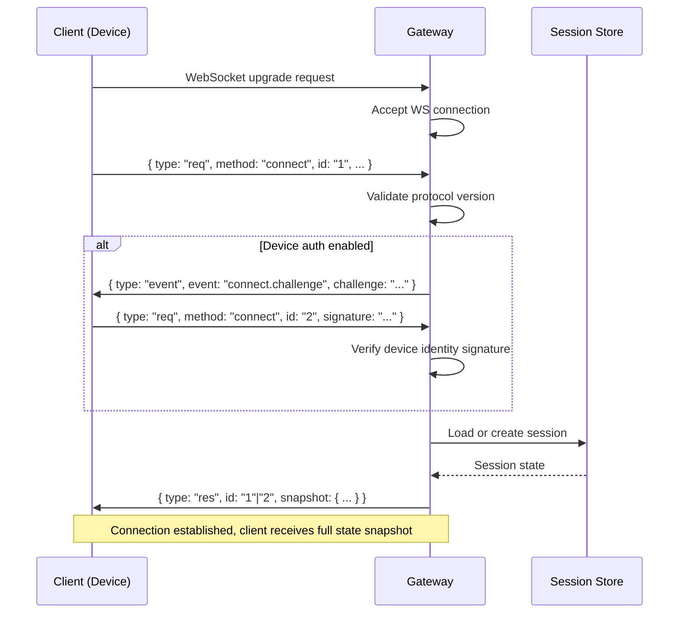
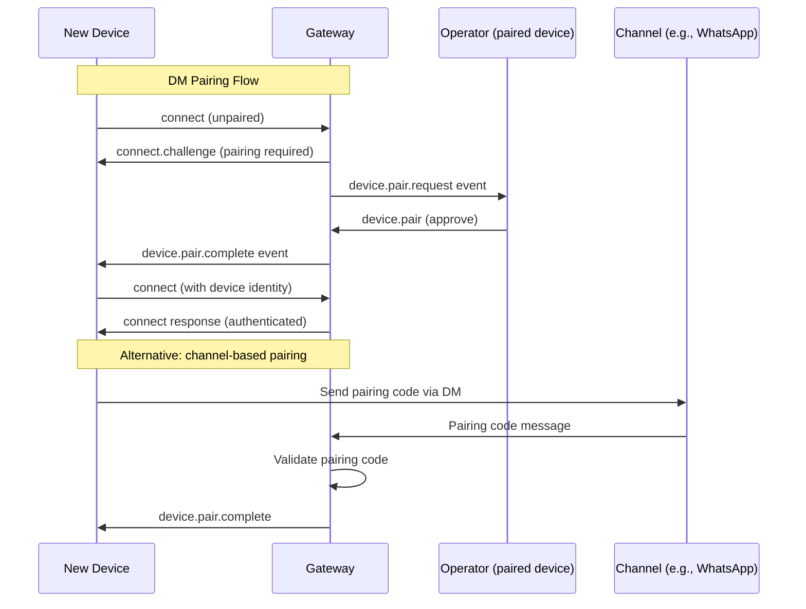
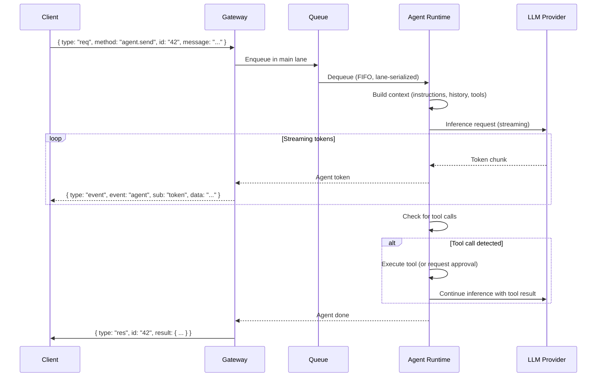
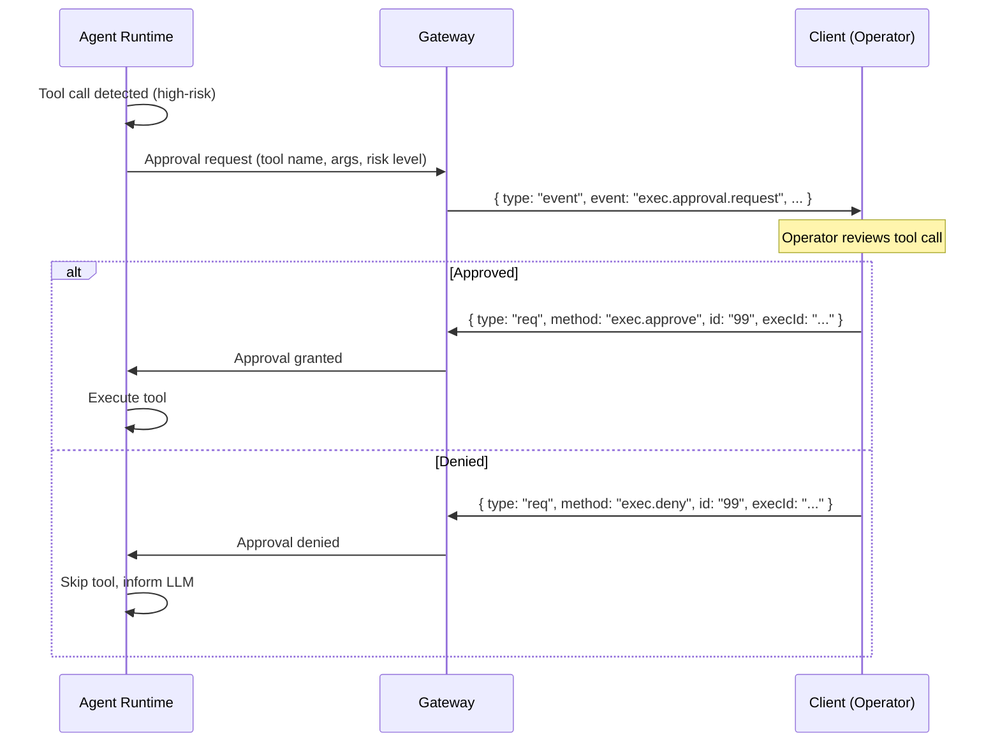
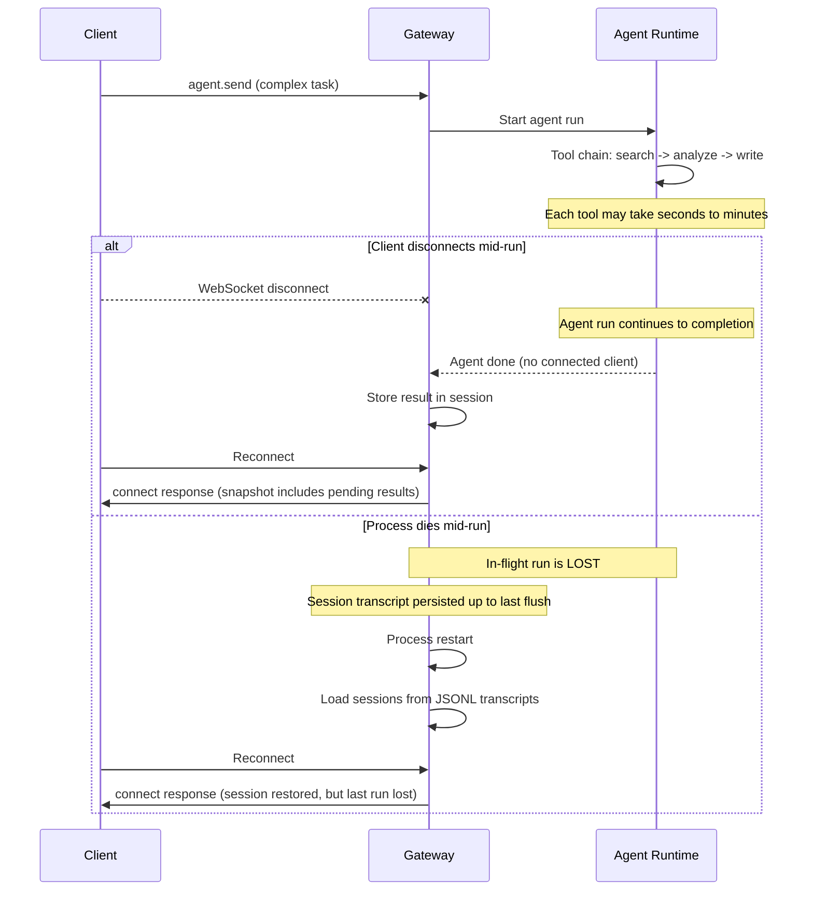
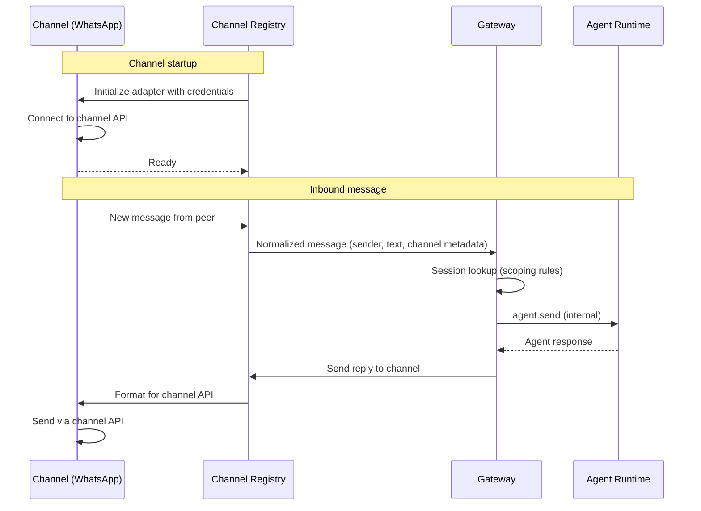
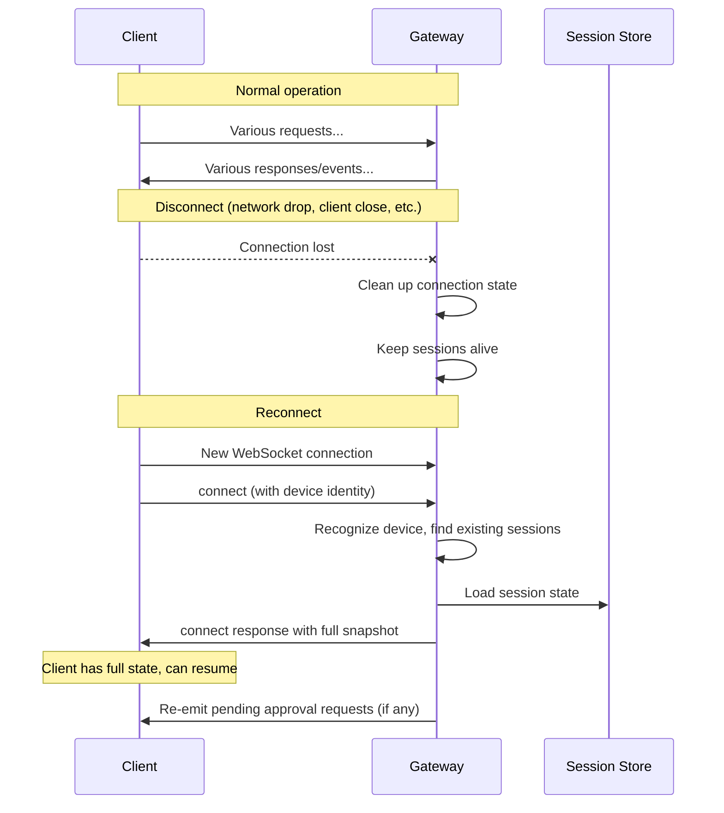
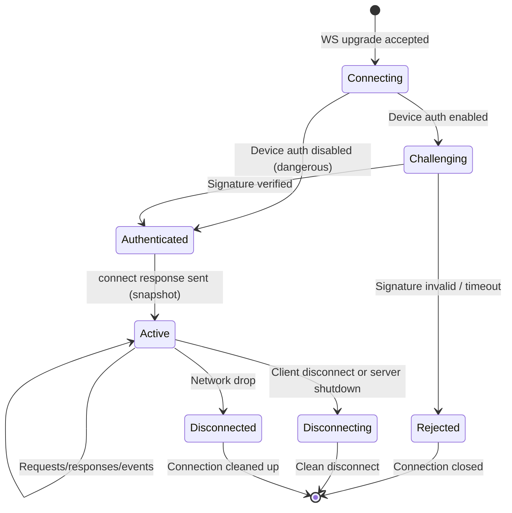
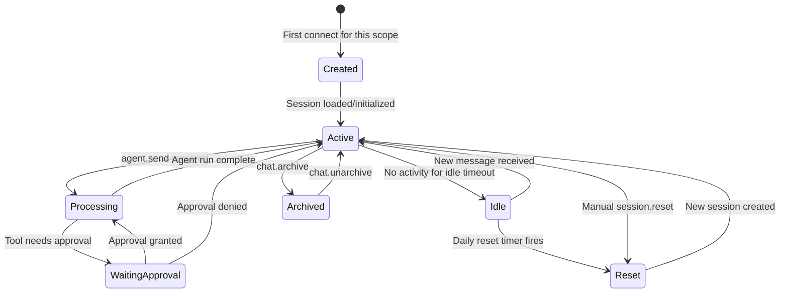
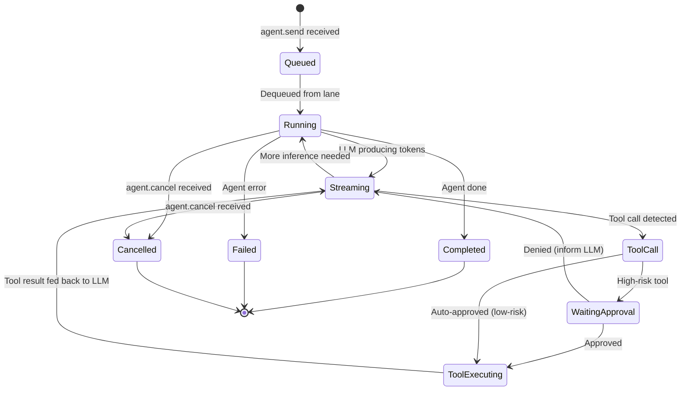

# SharpClaw Investigation Report

## OpenClaw Product Analysis & Microsoft Agent Framework Mapping

**Date**: 2026-02-27
**Status**: Complete (all 12 investigation items)
**Repos studied**:

- OpenClaw: `github.com/openclaw/openclaw` (233k stars, MIT, TypeScript 85.7%)
- Microsoft Agent Framework (dotnet): `github.com/microsoft/agent-framework/tree/main/dotnet` (7.5k stars, 26 NuGet packages)

---

## Table of Contents

- [0. Executive Summary](#0-executive-summary)
- [1. Product Positioning](#1-product-positioning)
- [2. Product Surface Inventory](#2-product-surface-inventory)
- [3. Functional Capabilities](#3-functional-capabilities)
- [4. Architecture and Runtime Model](#4-architecture-and-runtime-model)
- [5. Data Model, Persistence, and Determinism](#5-data-model-persistence-and-determinism)
- [6. Security and Threat Model](#6-security-and-threat-model)
- [7. Operational Concerns](#7-operational-concerns)
- [8. Parity Test Harness Design](#8-parity-test-harness-design)
- [9. AF Package Map and Patterns](#9-af-package-map-and-patterns)
- [10. Mapping Table: OpenClaw to Agent Framework](#10-mapping-table-openclaw-to-agent-framework)
- [11. Vertical Slice Design](#11-vertical-slice-design)
- [12. Appendices](#12-appendices)

---

## 0. Executive Summary

### Mission

Produce a product-level investigation of OpenClaw as a reference system and map its architecture, protocol, and operational model onto Microsoft Agent Framework (.NET) primitives, preparing the ground for a .NET 10 + C# 14 implementation called SharpClaw.

### Key Findings

1. **OpenClaw is a single-operator personal AI gateway**, not a multi-tenant SaaS platform. It runs as one process on the user's hardware, binding to loopback by default, and bridges multiple messaging channels (WhatsApp, Telegram, Slack, Discord, Signal, iMessage, Teams, Matrix, WebChat) through a single AI agent runtime. Trust model: one user, one machine, one gateway (`SECURITY.md`).

2. **The protocol surface is large but well-structured.** Protocol version 3 uses JSON text frames over WebSocket, discriminated on `type: "req"|"res"|"event"`. Over 70 request/response methods span 15 domains. 17 event types cover agent lifecycle, presence, pairing, cron, and health. All types are defined via TypeBox schemas (`src/gateway/protocol/schema/`), enabling JSON Schema and Swift model generation.

3. **Agent Framework provides strong execution primitives but no transport or protocol layer.** AF's `AIAgent`/`DelegatingAIAgent`/`ChatClientAgent` pipeline, `AgentSession` state, `AIContextProvider` lifecycle hooks, `WorkflowBuilder` graph engine, and `RequestPort` human-in-the-loop mechanism cover the agent execution domain well. However, AF has zero WebSocket server, zero protocol framing, zero channel adapters, zero model failover, zero queue/lane serialization, and zero config hot-reload.

4. **The gap analysis reveals SharpClaw must build ~44% of its infrastructure custom.** AF covers agent execution, middleware pipeline, tool invocation, streaming, session state, and observability decorators. SharpClaw must build: WebSocket server + protocol engine, channel adapter registry, device/DM pairing, model failover with exponential cooldowns, lane-aware queue, config hot-reload, and the full security layer (challenge-response auth, rate limiting, device identity).

5. **Security is achievable but requires careful design.** OpenClaw's fail-closed auth, DM pairing, device identity signing, and loopback-only bind are portable. Dangerous toggles exist (notably in Control UI auth/origin behavior), and private-network URL-fetch controls must be treated as SSRF protections rather than bind settings. SharpClaw should keep all insecure toggles off by default, require explicit opt-in, and audit-log usage.

6. **A vertical slice proof-of-fit is feasible** using AF's `AIAgentBuilder` with `DelegatingAIAgent` middleware for policy gating, `WorkflowBuilder` with `RequestPort` for approval nodes, `ChatClientAgent` for LLM invocation, and `CheckpointManager` for durability. The slice proves AF's execution model fits; it does not prove transport or protocol parity.

7. **The parity test strategy is contract-first.** Golden WebSocket transcripts captured from OpenClaw, replayed against SharpClaw's protocol engine, form the primary parity proof. TypeBox schemas generate contract tests. Property-based testing covers frame parsing and state machine transitions. Determinism tests verify same-input-same-output invariants.

8. **SharpClaw should use a dual deployment profile while preserving protocol parity.** [INFERENCE] Profile A is self-hostable and simple (`docker run` / Docker Compose) with execution sandboxes under one SharpClaw umbrella. Profile B is enterprise-grade horizontal scale (Kubernetes, optional Kata runtime isolation, optional Daytona execution provider). Provider order should be: Docker-in-Docker default, Podman-in-container fallback, Daytona optional.

9. **Container isolation must be explicit and enforceable.** [INFERENCE] SharpClaw should never mount host `/var/run/docker.sock` into the core process or subagents. All subagent spawning should be mediated by a dedicated Sandbox Manager boundary with least privilege, scoped credentials, audit logs, and network segmentation.

### Critical Gaps (must build custom)

| Gap | Complexity | Priority |
|-----|-----------|----------|
| WebSocket server + protocol v3 engine | High | P0 |
| Channel adapter registry + routing | High | P0 |
| Model failover with cooldowns | Medium | P0 |
| Lane-aware queue (main/subagent) | Medium | P0 |
| Device identity + challenge-response auth | Medium | P0 |
| DM pairing flow | Medium | P1 |
| Config hot-reload | Medium | P1 |
| Rate limiting (control writes) | Low | P1 |
| Session scoping (4 modes) | Medium | P1 |
| JSONL transcript persistence | Low | P2 |

### Recommendation

Proceed with a phased implementation using two deployment profiles from the start. Profile A (self-hosted) prioritizes ease of use and secure local operation via Docker Compose, with Docker-in-Docker as the default sandbox provider, Podman fallback, and Daytona optional. Profile B (enterprise) adds horizontal scale via Kubernetes, with optional Kata for high-isolation workloads and optional Daytona for ephemeral workspace workloads. Execute delivery using a dependency matrix and Beads issue graph (`bd`) so parallel-ready work is always maximized instead of scheduling by calendar phases. The vertical slice should still be implemented first as a proof-of-fit before committing to full channel breadth.

---

## 1. Product Positioning

### 1.1 Product Definition

OpenClaw is a personal AI assistant gateway that runs as a single process on the user's own hardware (laptop, home server, or cloud VM). It connects to the user's messaging accounts across multiple channels -- WhatsApp, Telegram, Slack, Discord, Signal, iMessage, Teams, Matrix, and a built-in WebChat -- and routes all conversations through a configurable AI agent runtime. The agent can invoke tools, execute code in a sandboxed environment, manage long-running operations with human approval gates, and maintain persistent conversation sessions. OpenClaw is designed for a single operator who controls all configuration, credentials, and trust decisions; it is explicitly not a multi-tenant platform.

**Citations**: `README.md` (product overview), `VISION.md` (priorities and non-goals), `SECURITY.md` (single-operator trust model).

### 1.2 User Personas and Roles

| Persona | Description | Trust Level |
|---------|-------------|-------------|
| **Operator** | The person who installs, configures, and runs OpenClaw on their hardware. Controls all secrets, model provider keys, channel credentials, and security settings. Single human per deployment. | Full trust (root) |
| **Admin** | In practice, same as operator. OpenClaw does not distinguish admin from operator in its security model. | Full trust |
| **Device** | A client application (mobile app, desktop app, browser) that connects to the gateway via WebSocket. Must complete device pairing (challenge-response with device identity signing) before gaining access. | Trust after pairing |
| **Client** | A messaging peer (contact on WhatsApp, Slack user, etc.) who interacts with the AI through a channel. Does not connect directly to the gateway; messages arrive through channel adapters. | Untrusted (messages are sanitized) |
| **Plugin Author** | Developer who creates plugins or MCP servers that extend the agent's tool capabilities. Plugins run in the agent's process context with access gated by tool policy. | Semi-trusted (policy-gated) |

**Citations**: `SECURITY.md` (trust model, out-of-scope), `src/pairing/` (device pairing), `src/plugin-sdk/` (plugin surface).

### 1.3 Primary Use Cases and Operator Workflows

1. **Personal AI across all channels**: Operator installs OpenClaw, configures model provider API keys (OpenAI, Anthropic, Google, local models), connects messaging accounts, and gets a unified AI assistant that responds across all channels.

2. **Tool-augmented workflows**: Operator configures tools (web search, code execution, file access, MCP servers) and the agent uses them autonomously or with approval gates for sensitive operations.

3. **Session continuity**: Conversations maintain context across reconnections, channel switches, and process restarts via persistent session transcripts.

4. **Multi-model failover**: Operator configures multiple model providers; the gateway automatically fails over when a provider is down, rate-limited, or billing-disabled, using exponential cooldowns.

5. **Approval workflows**: Sensitive tool executions require operator approval via the WebChat UI or mobile app before proceeding.

6. **Cron-scheduled tasks**: Operator configures recurring agent tasks (summaries, checks, reminders) via cron expressions.

### 1.4 Explicit Non-Goals and Out-of-Scope

From `VISION.md` and `SECURITY.md`:

- **Not multi-tenant**: No user isolation, role-based access control beyond operator/device, or per-user quotas.
- **Not a hosted service**: No signup flow, billing, or SLA. The operator manages their own infrastructure.
- **Not a model training platform**: No fine-tuning, RLHF, or model hosting. OpenClaw is inference-only.
- **Not an enterprise platform**: No SSO, LDAP, SAML, or organizational hierarchy.
- **Network-level attacks are out of scope**: DDoS, BGP hijacking, and DNS poisoning are the operator's infrastructure responsibility (`SECURITY.md`).

### 1.5 Disconfirming Evidence and Reconciliation

During investigation, we searched for evidence that OpenClaw might be multi-tenant, enterprise-targeted, or server-side hosted:

- **No multi-tenant evidence found.** No user tables, tenant isolation, or per-user credential stores exist anywhere in the codebase.
- **ACP bridge (`docs.acp.md`, `src/acp/`)** adds an Agent Client Protocol server, which could theoretically serve multiple clients. However, the ACP bridge inherits the same single-operator trust model and does not add authentication beyond the gateway's own. This is a protocol bridge, not a multi-tenancy feature.
- **Node pairing (`src/gateway/protocol/schema/nodes.ts`)** allows connecting multiple OpenClaw instances. This is federation/clustering for a single operator, not multi-tenancy.

**Conclusion**: The single-operator model is deeply embedded and consistent across all surfaces. SharpClaw should adopt the same model for v1.

---

## 2. Product Surface Inventory

### 2.1 External Surfaces Overview

| Surface | Protocol | Binding | Auth |
|---------|----------|---------|------|
| **Gateway Multiplexed Port** | WS + HTTP | `127.0.0.1:18789` (default, loopback-only) | WS: challenge-response + device auth; HTTP APIs: bearer/device auth by endpoint |
| **Control UI SPA** | HTTP (static assets + API calls to WS/HTTP surfaces) | Same port (`/`) | Browser session + device/pairing auth policy |
| **OpenResponses HTTP API** | HTTP `POST /v1/responses` (+ SSE streaming) | Same port (`/v1/responses`, optional enable) | Bearer token |
| **HTTP Health** | HTTP GET `/health` | Same port | None (health endpoint only) |
| **CLI** | Process invocation | Local shell | OS-level (process owner) |
| **Config Files** | YAML/JSON + `.env` | Filesystem | OS-level file permissions |
| **Plugin SDK** | In-process TypeScript API | Same process | Tool policy (allow/deny lists) |
| **MCP Servers** | stdio or SSE (MCP protocol) | Local or network | Per-server config |
| **ACP Bridge** | HTTP + SSE (Agent Client Protocol) | Configurable | Gateway auth passthrough |

**Citations**: `docs.openclaw.ai/web/control-ui` (default port 18789, Control UI), `docs.openclaw.ai/gateway/protocol` (WS protocol), `docs.openclaw.ai/gateway/openresponses-http-api` (`/v1/responses`), `src/cli/` (CLI commands), `.env.example` (config), `src/plugin-sdk/` (plugin API), `docs.acp.md` (ACP bridge).

#### Control UI Feature Inventory (first-class product surface)

Control UI is a web admin/operator surface (Vite + Lit SPA) served from the same gateway port. It is not a thin demo; it is a core operational plane.

- Chat operations: `chat.send`, `chat.abort`, `chat.inject`, history browsing, and streamed run updates.
- Config operations: schema-driven forms, validation, and base-hash guarded writes.
- Session/channel/node/device operations: list/status/connectivity/pairing workflows.
- Approval operations: view pending `exec` approvals and approve/deny actions.
- Ops operations: logs tail, health/debug panels, update/restart workflow, cron management.

**SharpClaw implication**: Treat web UI requirements as product requirements, not optional tooling.

#### HTTP API Inventory (OpenResponses compatibility surface)

OpenClaw exposes an optional OpenResponses-compatible HTTP API on the same gateway port:

- `POST /v1/responses` for request/response and streamed SSE output.
- OpenAI-style function tools invoke flow.
- Hook/middleware compatible request lifecycle with policy enforcement.
- File/image inputs with URL allowlists and private IP protections.

**SharpClaw implication**: HTTP parity is required in addition to WebSocket parity.

### 2.2 Protocol Method Catalog

Protocol version 3 uses JSON text frames over WebSocket. Every frame has a `type` discriminator: `"req"` (client-to-server request), `"res"` (server-to-client response), or `"event"` (server-to-client push). Requests carry an `id` field for correlation; responses echo it back.

Schema source: `src/gateway/protocol/schema/frames.ts`, `src/gateway/protocol/schema/protocol-schemas.ts`.

#### Handshake Frames (schema-accurate)

- **`connect` request (`ConnectParamsSchema`)** includes: protocol range (`minProtocol`/`maxProtocol`), client identity metadata, optional `role`, optional `scopes`, optional node capability declarations (`caps`, `commands`, `permissions`), optional `device` signature payload, and optional `auth` fields.
- **`hello-ok` response (`HelloOkSchema`)** includes: negotiated protocol, server metadata, advertised `features` (methods/events), optional `snapshot`, optional `canvasHostUrl`, optional auth envelope, and policy envelope (`maxPayload`, `maxBufferedBytes`, `tickIntervalMs`).

#### Roles, Scopes, and Capability Declarations

- Two handshake roles are modeled: `operator` (control plane client) and `node` (capability host).
- Operator scopes include: `operator.read`, `operator.write`, `operator.admin`, `operator.approvals`, `operator.pairing`.
- Node declarations (`caps`/`commands`/`permissions`) define what a node can execute or expose.

**SharpClaw implication**: enforce scopes server-side per method, and persist role/scope grants in paired-device metadata.

#### Core Methods

| Method | Direction | Description |
|--------|-----------|-------------|
| `connect` | req/res | First frame. Establishes session, negotiates protocol version. |
| `disconnect` | req | Client-initiated disconnect. |
| `ping` | req/res | Keepalive. |
| `pong` | event | Server keepalive response. |

#### Agent / Messaging Methods

| Method | Direction | Description |
|--------|-----------|-------------|
| `agent.send` | req/res | Send a message to the agent for processing. |
| `agent.cancel` | req/res | Cancel an in-flight agent run. |
| `agent.retry` | req/res | Retry the last failed agent run. |
| `agent.followup` | req/res | Send a follow-up message in the current run. |
| `agent.interrupt` | req/res | Interrupt the agent mid-stream (legacy). |

#### Chat Methods

| Method | Direction | Description |
|--------|-----------|-------------|
| `chat.list` | req/res | List chat conversations. |
| `chat.get` | req/res | Get a specific chat by ID. |
| `chat.create` | req/res | Create a new chat. |
| `chat.delete` | req/res | Delete a chat. |
| `chat.rename` | req/res | Rename a chat. |
| `chat.messages` | req/res | Get messages in a chat. |
| `chat.search` | req/res | Search across chats. |
| `chat.branch` | req/res | Branch a conversation at a specific message. |
| `chat.archive` | req/res | Archive a chat. |
| `chat.unarchive` | req/res | Unarchive a chat. |
| `chat.pin` | req/res | Pin a chat. |
| `chat.unpin` | req/res | Unpin a chat. |
| `chat.star` | req/res | Star a message. |
| `chat.unstar` | req/res | Unstar a message. |

#### Session Methods

| Method | Direction | Description |
|--------|-----------|-------------|
| `session.get` | req/res | Get current session state. |
| `session.reset` | req/res | Reset session (clear context). |
| `session.list` | req/res | List active sessions. |

#### Config Methods

| Method | Direction | Description |
|--------|-----------|-------------|
| `config.get` | req/res | Get current configuration. |
| `config.set` | req/res | Update configuration at runtime. |
| `config.reset` | req/res | Reset configuration to defaults. |
| `config.validate` | req/res | Validate a config change without applying. |
| `config.export` | req/res | Export configuration. |
| `config.import` | req/res | Import configuration. |

#### Node Methods

| Method | Direction | Description |
|--------|-----------|-------------|
| `node.list` | req/res | List paired nodes. |
| `node.pair` | req/res | Initiate node pairing. |
| `node.unpair` | req/res | Remove a paired node. |
| `node.status` | req/res | Get node status. |

#### Device Methods

| Method | Direction | Description |
|--------|-----------|-------------|
| `device.list` | req/res | List paired devices. |
| `device.pair` | req/res | Initiate device pairing. |
| `device.unpair` | req/res | Remove a paired device. |
| `device.rename` | req/res | Rename a device. |
| `device.status` | req/res | Get device status. |

#### Exec Approval Methods

| Method | Direction | Description |
|--------|-----------|-------------|
| `exec.approve` | req/res | Approve a pending tool execution. |
| `exec.deny` | req/res | Deny a pending tool execution. |
| `exec.list` | req/res | List pending approvals. |
| `exec.get` | req/res | Get details of a pending approval. |

#### Agents / Models / Skills / Tools CRUD

| Method | Direction | Description |
|--------|-----------|-------------|
| `agents.list` | req/res | List configured agents. |
| `agents.get` | req/res | Get agent configuration. |
| `agents.create` | req/res | Create a new agent configuration. |
| `agents.update` | req/res | Update agent configuration. |
| `agents.delete` | req/res | Delete agent configuration. |
| `models.list` | req/res | List configured models. |
| `models.get` | req/res | Get model configuration. |
| `models.set` | req/res | Set model configuration. |
| `skills.list` | req/res | List available skills. |
| `skills.get` | req/res | Get skill details. |
| `skills.install` | req/res | Install a skill. |
| `skills.uninstall` | req/res | Uninstall a skill. |
| `tools.list` | req/res | List available tools. |
| `tools.get` | req/res | Get tool details. |
| `tools.toggle` | req/res | Enable/disable a tool. |

#### Channel / Talk / TTS Methods

| Method | Direction | Description |
|--------|-----------|-------------|
| `channel.list` | req/res | List connected channels. |
| `channel.status` | req/res | Get channel connection status. |
| `channel.connect` | req/res | Connect a channel. |
| `channel.disconnect` | req/res | Disconnect a channel. |
| `talk.start` | req/res | Start voice session. |
| `talk.stop` | req/res | Stop voice session. |
| `talk.send` | req/res | Send audio data. |
| `tts.speak` | req/res | Text-to-speech request. |
| `tts.stop` | req/res | Stop TTS playback. |

#### Cron Methods

| Method | Direction | Description |
|--------|-----------|-------------|
| `cron.list` | req/res | List cron jobs. |
| `cron.create` | req/res | Create a cron job. |
| `cron.update` | req/res | Update a cron job. |
| `cron.delete` | req/res | Delete a cron job. |
| `cron.trigger` | req/res | Manually trigger a cron job. |

#### Log / Browser / Wizard Methods

| Method | Direction | Description |
|--------|-----------|-------------|
| `logs.get` | req/res | Get logs with filters. |
| `logs.stream` | req/res | Stream logs in real time. |
| `browser.navigate` | req/res | Navigate browser tool. |
| `browser.screenshot` | req/res | Take browser screenshot. |
| `wizard.start` | req/res | Start setup wizard. |
| `wizard.step` | req/res | Advance wizard step. |
| `wizard.complete` | req/res | Complete wizard. |

**Note**: The exact method count varies as some methods have sub-variants. The catalog above captures the primary methods discovered across `src/gateway/server-methods/` and `src/gateway/protocol/schema/`. [INFERENCE] Some methods may be internal-only or deprecated; the protocol schema files are the authoritative source.

### 2.3 Event Type Catalog

Events are server-to-client pushes with no request ID. Schema: `src/gateway/protocol/schema/frames.ts`.

| Event | Description | Payload |
|-------|-------------|---------|
| `connect.challenge` | Auth challenge during handshake | Challenge nonce, device identity requirements |
| `agent` | Agent lifecycle updates (thinking, tool use, streaming tokens, completion) | Varies by sub-type: `agent.thinking`, `agent.tool_start`, `agent.tool_end`, `agent.token`, `agent.done`, `agent.error` |
| `chat` | Chat state changes (new message, edit, delete) | Chat ID, message data |
| `presence` | Device/peer presence changes (online, offline, typing) | Peer ID, status |
| `tick` | Periodic heartbeat with server state | Timestamp, connection count, active operations |
| `shutdown` | Server is shutting down gracefully | Reason, timeout |
| `health` | Health status change | Component statuses |
| `heartbeat` | Low-level keepalive | Timestamp |
| `cron` | Cron job execution notification | Job ID, result |
| `node.pair.request` | Incoming node pairing request | Node ID, challenge |
| `node.pair.complete` | Node pairing completed | Node ID, status |
| `node.pair.reject` | Node pairing rejected | Node ID, reason |
| `device.pair.request` | Incoming device pairing request | Device ID, challenge |
| `device.pair.complete` | Device pairing completed | Device ID, status |
| `device.pair.reject` | Device pairing rejected | Device ID, reason |
| `exec.approval.request` | Tool execution awaiting approval | Exec ID, tool name, arguments, risk level |
| `exec.approval.result` | Approval decision made | Exec ID, approved/denied |
| `update.available` | Software update available | Version, changelog URL |
| `voicewake.changed` | Voice wake word detection state changed | Active/inactive |

**Citations**: `src/gateway/protocol/schema/frames.ts`, `src/gateway/protocol/schema/exec-approvals.ts`, `src/gateway/protocol/schema/devices.ts`, `src/gateway/protocol/schema/nodes.ts`.

### 2.4 Error Code Taxonomy

Error codes are defined in `src/gateway/protocol/schema/error-codes.ts`. Errors are returned in response frames with an `error` field conforming to `ErrorShapeSchema`:

```
ErrorShape {
  code: string        // Non-empty string code (NOT numeric)
  message: string     // Human-readable description
  details?: unknown   // Optional structured context
  retryable?: boolean // Whether the client should retry
  retryAfterMs?: number // Suggested retry delay in milliseconds
}
```

There are exactly **5 string error codes**:

| Code | Meaning | Typical Context |
|------|---------|-----------------|
| `NOT_LINKED` | Device not linked to gateway | Connection attempt from unknown device |
| `NOT_PAIRED` | Device not paired (pairing incomplete) | Handshake fails before pairing approval |
| `AGENT_TIMEOUT` | Agent run exceeded timeout | LLM call or tool execution too slow |
| `INVALID_REQUEST` | Malformed or invalid request | Schema validation failure, unknown method |
| `UNAVAILABLE` | Service temporarily unavailable | Gateway shutting down, dependency failure |

**SharpClaw parity note**: Error codes are strings, not numeric ranges. The `retryable` and `retryAfterMs` fields enable client-side retry logic without hardcoding per-code behavior.

**Citation**: `src/gateway/protocol/schema/error-codes.ts` (ErrorShapeSchema, error code constants).

### 2.5 Wire Semantics

#### Ordering and Correlation

- **Request/response correlation**: Every request frame carries a unique `id` (string). The server echoes this `id` in the response. Clients must not reuse IDs within a connection.
- **Ordering**: Requests are processed in order within a lane (see Section 4 on queue lanes). Events may arrive between request/response pairs (interleaved).
- **Optional sequence numbers**: `EventFrameSchema` includes optional `seq?: number` and `stateVersion?` fields. When present, `seq` provides monotonically increasing event ordering within a connection, and `stateVersion` enables optimistic concurrency checks on state snapshots. These are not mandatory — clients must handle events both with and without sequence numbers.

#### Idempotency

- **Side-effecting methods require idempotency keys.** The protocol documentation specifies that mutating operations (e.g., `chat.send`, `config.set`) must include an `idempotencyKey` field. Re-sending a request with the same `idempotencyKey` returns `{status: "in_flight"}` rather than creating a duplicate operation.
- **`chat.send` is non-blocking.** It acknowledges immediately with `{runId, status: "started"}` and streams results via events. Re-sending the same `idempotencyKey` returns the in-flight status rather than starting a new agent run.
- **SharpClaw parity**: Must implement idempotency key tracking for all side-effecting methods. Suggest a time-windowed dedup store (e.g., 5-minute TTL) keyed by `(connectionId, idempotencyKey)`.

**Citations**: `docs.openclaw.ai/gateway/protocol` (idempotency key requirement), `docs.openclaw.ai/web/control-ui` (chat.send ack shape, in_flight behavior).

#### Timeouts, Retries, and Backpressure

- **Request timeout**: 30 seconds default for most methods. Agent runs have no fixed timeout (they complete when the LLM finishes).
- **Backpressure**: Queue cap of 20 messages per lane. Exceeding the cap returns error `UNAVAILABLE`. Debounce of 1000ms between queue drains.
- **Rate limiting**: 3 control writes per 60 seconds on config/admin methods.
- **Client-side retries**: Not specified by the protocol. The reference client (Control UI) implements exponential backoff for reconnection. The `retryable` and `retryAfterMs` fields on `ErrorShape` provide server-driven retry hints.

**Citations**: `docs.openclaw.ai/concepts/queue` (queue cap, debounce), `docs.openclaw.ai/concepts/retry` (retry policy), `src/gateway/protocol/schema/error-codes.ts` (error shape with retryable/retryAfterMs).

#### Reconnection and Session Resync

- On disconnect, the client must re-establish the WebSocket connection and send a new `connect` frame.
- If the device is already paired, the server recognizes the device identity and resumes the session without re-pairing.
- Session state (conversation history, pending operations) persists across reconnections via the session store.
- Pending approval requests are re-emitted as events after reconnection.
- In-flight agent runs are NOT resumed; they are lost on disconnect. The client must re-send the message.

**Citations**: `docs.openclaw.ai/gateway/pairing` (reconnection), `docs.openclaw.ai/concepts/session` (session persistence).

### 2.6 Compatibility Quirks and Legacy Behaviors

| Quirk | Description | Classification |
|-------|-------------|---------------|
| `agent.interrupt` method | Legacy interrupt mechanism, replaced by `agent.cancel` | Do not port |
| Protocol v1/v2 frames | Older frame formats still accepted for backward compat | Do not port (v3 only) |
| `dangerouslyAllowPrivateNetwork` behavior | Browser/private-network fetch safety control (SSRF context), not gateway bind control | Port as URL-fetch guard policy; do not model as bind toggle |
| Implicit `main` session | If no session scoping configured, all messages go to one session | Must match for parity |
| JSONL transcript format | Specific line-delimited JSON format for session transcripts | Must match for parity |
| Legacy channel name aliases | `clawdbot` and `moltbot` package names redirect to `openclaw` | Do not port |
| TypeBox-specific schema features | Some schemas use TypeBox-specific extensions not in JSON Schema | Optional (use .NET equivalent) |

---

## 3. Functional Capabilities

### 3.1 Capability Inventory by Subsystem

#### Gateway / Transport

- WebSocket server with TLS optional (typically behind reverse proxy)
- Loopback-only bind by default; configurable to bind to `0.0.0.0` or specific interfaces
- Multiplexed gateway port serving WS protocol + health + Control UI + optional OpenResponses HTTP API
- mDNS/DNS-SD discovery for local network (`docs.openclaw.ai/gateway/discovery`)
- Connection lifecycle management (connect, auth, keepalive, disconnect)

**Citations**: `src/gateway/server/`, `docs.openclaw.ai/gateway/discovery`.

#### Protocol

- Protocol version 3 with JSON text frames
- Discriminated union on `type` field (req/res/event)
- TypeBox schema definitions with JSON Schema generation
- Swift model generation for iOS client
- Frame validation against schemas

**Citations**: `src/gateway/protocol/schema/`, `package.json` (protocol:gen scripts).

#### Security / Auth

- Challenge-response authentication during `connect` handshake
- Device identity signing (Ed25519 keypairs)
- DM pairing flow (pair a device via direct message on a channel)
- Fail-closed: unauthenticated connections cannot invoke any method except `connect`
- Loopback-only bind by default

**Citations**: `docs.openclaw.ai/gateway/security`, `src/pairing/`, `SECURITY.md`.

#### Policy / Authorization

- Tool execution policy: hierarchical allow/deny lists (profile level, provider level, per-tool)
- Exec approval gates: tools classified by risk level, high-risk tools require operator approval
- No RBAC or per-user policies (single-operator model)

**Citations**: `docs.openclaw.ai/tools` (tool policy), `src/gateway/protocol/schema/exec-approvals.ts`.

#### Workflows / Approvals

- Exec approval lifecycle: tool invocation triggers approval request event, operator approves/denies via connected device, result flows back to agent loop
- Timeout on pending approvals (configurable, default varies)
- Approval state persists across reconnections

**Citations**: `src/gateway/protocol/schema/exec-approvals.ts`, `docs.openclaw.ai/concepts/agent-loop`.

#### Operations / Long-Running Work

- Agent runs are long-running operations (can take minutes for complex tool chains)
- Streaming token events during agent runs
- Cancellation via `agent.cancel`
- No built-in checkpointing of partial agent runs; if the process dies mid-run, the run is lost
- Cron jobs for scheduled operations

**Citations**: `docs.openclaw.ai/concepts/streaming`, `src/gateway/protocol/schema/cron.ts`.

#### Channels / Plugins

- 10+ channel adapters: WhatsApp, Telegram, Slack, Discord, Signal, iMessage, Teams, Matrix, WebChat, and others
- Channel registry with connect/disconnect lifecycle
- Plugin SDK for custom tool providers
- Plugin code runs in-process as trusted extension code (no process sandbox by default)
- MCP server integration (stdio and SSE transports)
- Skills platform for pre-built tool bundles

**Citations**: `src/channels/` (channel registry), `src/plugin-sdk/` (plugin SDK), `docs.openclaw.ai/tools/skills`.

#### Persistence / Recovery

- JSONL transcript files for session history
- Session state in memory with periodic flush
- Configuration persisted to filesystem (YAML/JSON + `.env`)
- No database dependency (filesystem-only by default)
- Process restart recovers sessions from transcript files; in-flight operations are lost

**Citations**: `src/sessions/` (session store), `docs.openclaw.ai/concepts/session`.

#### Observability / Audit

- JSONL structured logging
- OpenTelemetry metrics: `openclaw.tokens`, `openclaw.cost.usd`, `openclaw.run.duration_ms`, and others
- OpenTelemetry trace spans for agent runs
- Connection count and active operation metrics via `tick` events
- No built-in audit log (operator can derive from structured logs)

**Citations**: `docs.openclaw.ai/logging`, `docs.openclaw.ai/concepts/usage-tracking`.

#### Configuration / Admin Surfaces

- YAML/JSON config files with `.env` for secrets
- Runtime config mutation via `config.set` WS method
- Config hot-reload: four modes (hybrid, hot, restart, off)
- Config validation via `config.validate` method
- Setup wizard for initial configuration
- Web-based Control UI SPA is a first-class admin/operator surface (chat, config, logs, approvals, cron, updates)

**Citations**: `docs.openclaw.ai/gateway/configuration`, `.env.example`.

### 3.2 Core v1 vs Later Split

#### Core v1 (Minimum Viable SharpClaw)

These capabilities are required for a functional personal AI gateway:

| Capability | Justification |
|-----------|--------------|
| WebSocket server + Protocol v3 engine | Foundation; nothing works without it |
| Connect/auth/disconnect lifecycle | Security baseline |
| `agent.send` / `agent.cancel` / agent events | Core agent interaction |
| Single session (main) | Simplest session model |
| One channel adapter (WebChat) | Minimum viable channel |
| One model provider (OpenAI or Anthropic) | Minimum viable LLM |
| Tool invocation (basic) | Core agent capability |
| Streaming token events | Essential UX |
| JSONL session persistence | Session continuity |
| Health endpoint | Operational baseline |
| Structured logging | Debuggability |
| Loopback-only bind | Security baseline |

#### Later (Phase 2+)

| Capability | Justification |
|-----------|--------------|
| Model failover with cooldowns | Reliability, not MVP |
| Lane-aware queue (main + subagent) | Performance optimization |
| Exec approval workflow | Important but not blocking basic use |
| Multi-session scoping (4 modes) | Complexity; main session is sufficient for v1 |
| Additional channels (WhatsApp, Telegram, etc.) | Incremental; WebChat proves the model |
| DM pairing | Needed for mobile channels, not WebChat |
| Device identity signing | Needed for multi-device, not single-device |
| Config hot-reload | Convenience; restart is acceptable for v1 |
| Cron jobs | Scheduled tasks are a feature, not infrastructure |
| Voice / TTS | Separate product surface |
| Node pairing (multi-instance) | Advanced topology |
| MCP server integration | Tool ecosystem expansion |
| Skills platform | Tool ecosystem expansion |
| Browser tool | Specialized tool |
| Setup wizard | Convenience |

**Justification**: This split follows the principle of "make it work, then make it right, then make it fast." Core v1 delivers a functional single-user, single-device, single-channel AI gateway that proves the architecture. Each Later item adds breadth (more channels, more tools) or depth (failover, queue optimization) incrementally.

### 3.3 SharpClaw Execution Fabric Strategy (build target)

To preserve OpenClaw behavior while enabling isolated subagent execution and horizontal scale, SharpClaw should separate control plane concerns from execution fabric concerns.

#### Control Plane (always-on core)

- Gateway protocol handling (WS + HTTP + OpenResponses surface)
- Auth/pairing/scope enforcement
- Scheduling, idempotency, approvals, audit
- Configuration and operator UX surfaces

#### Execution Fabric (pluggable providers)

- **Default**: Docker-in-Docker (`dind`) provider
- **Fallback**: Podman-in-container provider
- **Optional**: Daytona provider (both local and enterprise)
- **Enterprise**: Kubernetes provider, optionally placing selected workloads on Kata runtime class

Subagents spawned by any provider should register as protocol `node` role clients with explicit `caps`/`commands`/`permissions` and short-lived credentials.

#### Hard isolation requirement

- **Do not mount host Docker socket** (`/var/run/docker.sock`) into SharpClaw or subagent containers.
- Use a dedicated Sandbox Manager boundary to broker spawn/stop/inspect actions.
- Enforce per-sandbox quotas, egress policy, and lifecycle limits.

### 3.4 SharpClaw naming conventions (build target)

[INFERENCE] Use naming patterns aligned with ABP, Microsoft, and Orleans ecosystems:

- **Shared foundations**: `*.Abstractions`, `*.Contracts`, `*.Extensions.*`
- **Domain/context modules**: `Identity`, `Conversations`, `Runs`, `Approvals`, `Configuration`, `Operations`
- **Provider/infrastructure modules**: `Execution.<Provider>`, `Persistence.<Provider>`, `OpenResponses.HttpApi`

Recommended examples:

- `SharpClaw.Abstractions`
- `SharpClaw.Protocol.Contracts`
- `SharpClaw.Protocol.Abstractions`
- `SharpClaw.Execution.Abstractions`
- `SharpClaw.Persistence.Abstractions`
- `SharpClaw.Extensions.Hosting`
- `SharpClaw.Extensions.DependencyInjection`
- `SharpClaw.Execution.Docker` (default `dind` provider)
- `SharpClaw.Execution.Podman` (fallback)
- `SharpClaw.Execution.Daytona` (optional)

---

## 4. Architecture and Runtime Model

### 4.1 Major Subsystems and Module Boundaries

```
openclaw/
  src/
    gateway/          # WebSocket server, protocol engine, method dispatch
      server/         # HTTP/WS server, connection management
      server-methods/ # Handler implementations for each WS method
      protocol/       # Frame parsing, validation, schema
        schema/       # TypeBox type definitions
    agents/           # Agent runtime
      pi-embedded-runner/ # Primary agent loop (Pi agent)
      tools/          # Tool registry and execution
      sandbox/        # Code execution sandbox
      skills/         # Skills platform
      auth-profiles/  # Model provider auth rotation
    sessions/         # Session store, transcript persistence
    channels/         # Channel adapter registry, routing
    config/           # Configuration parsing, validation, hot-reload
    pairing/          # Device and DM pairing flows
    memory/           # Agent memory system
    plugin-sdk/       # Plugin developer SDK
    plugins/          # Plugin runtime
    acp/              # Agent Client Protocol bridge
    cli/              # CLI commands
```

**Key boundaries**:

1. **Gateway <-> Agent**: The gateway dispatches `agent.send` to the agent runtime and receives streaming events back. The agent runtime is unaware of WebSocket framing.
2. **Gateway <-> Channels**: Channel adapters translate channel-specific message formats into the gateway's internal message format. The gateway routes to/from channels via the channel registry.
3. **Agent <-> Tools**: Tools are invoked by the agent runtime through the tool registry. Tool execution may trigger approval requests that flow back through the gateway to connected devices.
4. **Config <-> Everything**: Configuration is injected into all subsystems. Hot-reload propagates changes without restart.

### 4.2 Entry Points and Process Model

OpenClaw runs as a **single Node.js process**. Entry point is `src/cli/` which parses commands and starts the gateway. The gateway starts:

1. HTTP/WS server on configured port
2. Channel adapters for configured channels
3. Agent runtime with configured model providers
4. Session store from filesystem
5. Config watcher for hot-reload

There is no multi-process architecture, no worker threads for agent runs (Node.js event loop handles concurrency), and no external dependencies beyond the filesystem and configured API endpoints.

**Citation**: `src/cli/`, `src/gateway/server/`.

### 4.2.1 SharpClaw Target Topology (reference evolution)

OpenClaw is a single process by design. SharpClaw should keep that as parity baseline but add two explicit target topologies:

1. **Profile A: Self-hosted Local**
   - One Compose project, single control-plane container
   - Internal infrastructure containers (state/event components)
   - Subagent containers spawned under Sandbox Manager and isolated within the same project umbrella

2. **Profile B: Enterprise Distributed**
   - Horizontally scaled edge/control components
   - Externalized state/event backbone
   - Execution workers on Kubernetes (optional Kata), optional Daytona provider

Both profiles should preserve the same protocol-level behavior for clients.

### 4.3 Sequence Diagrams

#### 4.3.1 WebSocket Connect and Handshake



#### 4.3.2 Auth and Pairing Lifecycle



#### 4.3.3 Request/Response/Event Envelope Flow



#### 4.3.4 Approvals and Human-in-the-Loop



#### 4.3.5 Long-Running Operations and Resumability



#### 4.3.6 Plugin/Channel Discovery and Invocation



#### 4.3.7 Disconnect/Reconnect Recovery



### 4.4 State Machines

#### 4.4.1 Connection State Machine



#### 4.4.2 Session Lifecycle State Machine



#### 4.4.3 Operation (Agent Run) Lifecycle State Machine



---

## 5. Data Model, Persistence, and Determinism

### 5.1 What is Persisted and Where

| Data | Storage | Format | Location |
|------|---------|--------|----------|
| Session transcripts | Filesystem | JSONL (one JSON object per line) | `~/.openclaw/sessions/` |
| Configuration | Filesystem | YAML/JSON + `.env` | `~/.openclaw/config/` or project root |
| Device identities | Filesystem | JSON (keypairs) | `~/.openclaw/devices/` |
| Paired devices registry | Filesystem | JSON | `~/.openclaw/devices/paired.json` |
| Agent memory | Filesystem | JSON | `~/.openclaw/memory/` |
| Plugin registry | Filesystem | JSON | `~/.openclaw/plugins/` |
| Logs | Filesystem | JSONL | `~/.openclaw/logs/` or stdout |
| Model provider credentials | `.env` file | Plaintext env vars | `.env` in project root |
| In-flight operation state | Memory only | N/A | Lost on process death |

**Key observation**: OpenClaw is entirely filesystem-based. No database, no Redis, no external state store. This simplifies deployment but limits horizontal scaling (which is explicitly a non-goal).

**Citations**: `src/sessions/` (session store implementation), `docs.openclaw.ai/concepts/session` (session persistence), `.env.example` (credential storage).

### 5.2 Determinism Invariants

#### Must be deterministic

- **Protocol frame parsing**: Same bytes must produce same parsed frame, every time. No ambient state affects parsing.
- **Session scoping**: Given a message with (sender, channel, account) metadata, the session scope selection must always resolve to the same session ID.
- **Tool policy evaluation**: Given a tool invocation and the current policy configuration, the allow/deny decision must be deterministic.
- **Config validation**: Same config input must produce same validation result.
- **Error code selection**: Same error condition must produce same error code.

#### May be nondeterministic

- **LLM inference**: Model responses are inherently nondeterministic (temperature, sampling). This is expected and not a defect.
- **Tool execution results**: External tool calls (web search, API calls) return different results over time.
- **Timestamps**: Log timestamps, session creation times, etc.
- **Connection ordering**: Multiple clients connecting simultaneously may be processed in any order.

#### Must be replayable

- **Session transcripts**: Given a JSONL transcript file, the session history must be reconstructable. Each line is a self-contained message record with timestamps, roles, and content.
- **Config changes**: Config mutations are logged; the config state at any point can be reconstructed from the initial config plus the mutation log.

### 5.3 Minimal Viable Durable Storage Model

For SharpClaw v1, the minimum storage requirement is:

| Store | Purpose | Format | Required |
|-------|---------|--------|----------|
| Session transcript store | Persist conversation history across restarts | JSONL files per session | Yes (P0) |
| Config store | Persist operator configuration | YAML/JSON + env vars | Yes (P0) |
| Device identity store | Persist device keypairs for auth | JSON | Yes if device auth enabled (P0) |
| Log store | Persist structured logs | JSONL or structured logging sink | Yes (P0) |
| Memory store | Persist agent long-term memory | JSON | No (P2) |
| Plugin registry | Track installed plugins | JSON | No (P2) |

**Storage abstraction**: SharpClaw should define storage interfaces (`ISessionStore`, `IConfigStore`, `IDeviceStore`) with filesystem implementations as defaults. This allows future migration to database-backed stores without architectural changes.

### 5.4 Data Retention, Auditability, and Privacy

- **Retention**: OpenClaw does not implement automatic data retention policies. Session transcripts grow indefinitely. The operator is responsible for cleanup. [INFERENCE] SharpClaw should add configurable retention policies.
- **Auditability**: All agent interactions are logged in session transcripts. Config changes are logged. Tool executions are logged with arguments and results. There is no separate audit log, but the combination of session transcripts and structured logs provides a complete audit trail.
- **Privacy**: Session transcripts contain the full text of all conversations, including messages from channel peers. The operator is responsible for compliance with data protection regulations. OpenClaw does not implement PII detection, redaction, or data subject access requests.
- **Secrets in logs**: Model provider API keys are stored in `.env` and are not logged. Tool execution logs may contain sensitive data (file contents, API responses). OpenClaw does not redact tool execution logs.

---

## 6. Security and Threat Model

### 6.1 Trust Boundaries and Threat Assumptions

```
┌─────────────────────────────────────────────────┐
│                 Operator Machine                 │
│                                                  │
│  ┌──────────────┐    ┌────────────────────────┐ │
│  │ .env secrets  │    │     OpenClaw Process    │ │
│  │ (full trust)  │───>│                        │ │
│  └──────────────┘    │  ┌─────────────────┐   │ │
│                      │  │ Gateway (WS)     │   │ │
│  ┌──────────────┐    │  │  loopback:18789  │   │ │
│  │ Paired Device │<──>│  └────────┬────────┘   │ │
│  │ (trust after  │    │           │            │ │
│  │  pairing)     │    │  ┌────────▼────────┐   │ │
│  └──────────────┘    │  │ Agent Runtime    │   │ │
│                      │  │  (semi-trusted)  │   │ │
│                      │  └────────┬────────┘   │ │
│                      │           │            │ │
│                      │  ┌────────▼────────┐   │ │
│                      │  │ Channel Adapters │   │ │
│                      │  │  (external APIs) │   │ │
│                      │  └────────┬────────┘   │ │
│                      └───────────┼────────────┘ │
└──────────────────────────────────┼───────────────┘
                                   │
                    ┌──────────────▼──────────────┐
                    │    External (Untrusted)      │
                    │                              │
                    │  • Channel peers (WhatsApp   │
                    │    contacts, Slack users)     │
                    │  • LLM provider APIs          │
                    │  • Tool endpoints             │
                    │  • MCP servers (semi-trusted) │
                    └──────────────────────────────┘
```

**Trust levels**:

1. **Full trust**: Operator, filesystem, process environment
2. **Trust after pairing**: Paired devices (verified via challenge-response)
3. **Semi-trusted**: Plugins, MCP servers, agent runtime (policy-gated)
4. **Untrusted**: Channel peers, external APIs, network

**Threat assumptions** (from `SECURITY.md`):

- The operator's machine is not compromised (if it is, all bets are off)
- Network-level attacks (DDoS, BGP hijack) are out of scope
- The operator manages their own TLS termination (via reverse proxy)
- Channel API credentials are as secure as the operator's account security on those platforms

### 6.2 Insecure Convenience Toggles

| Toggle | Default | Risk | Classification |
|--------|---------|------|---------------|
| `gateway.controlUi.dangerouslyDisableDeviceAuth` | `false` | Allows Control UI WS clients to connect without device identity verification. Complete auth bypass. | **Do not port as default.** If ported: feature flag, audit log every connection, console warning on startup. |
| `gateway.controlUi.dangerouslyAllowHostHeaderOriginFallback` | `false` | Falls back to Host header for origin checking when Origin header is missing. Enables CSRF-like attacks from malicious web pages. | **Do not port.** Reject connections without proper Origin header. |
| `gateway.controlUi.allowInsecureAuth` | `false` | Allows weaker/non-challenge auth paths in Control UI. Enables replay and impersonation risk. | **Do not port as default.** If ported: feature flag, audit log, TLS-only enforcement. |
| `dangerouslyAllowPrivateNetwork` | [UNVERIFIED] | Private-network URL fetch policy in browser/tool request context (SSRF guard), not gateway bind control. | **Model as outbound URL policy, not bind setting.** Default deny for private IP targets unless explicitly allowed. |

**SharpClaw recommendation**: None of these toggles should be enabled by default. Each should require:

1. Explicit opt-in via config (not just env var)
2. Startup warning logged at WARN level
3. Audit log entry for every operation performed while the toggle is active
4. Documentation of the security implications

### 6.3 Threat Model: Abuse Cases

#### Abuse Case 1: Replay Attack

**Description**: Attacker captures a valid `connect` frame with device signature and replays it to gain access.

**OpenClaw defenses**: Challenge-response with server-generated nonce. Each challenge is unique and has a short expiry. Replaying an old signature against a new challenge fails.

**Gaps**: If `allowInsecureAuth` is enabled, plaintext tokens can be replayed. No TLS enforcement at the protocol level (relies on operator's reverse proxy).

**SharpClaw recommendation**: Implement challenge-response with nonce. Add optional TLS enforcement flag. Never enable `allowInsecureAuth` by default.

#### Abuse Case 2: Privilege Escalation via Tool Injection

**Description**: A channel peer crafts a message that tricks the LLM into invoking a tool the peer should not have access to.

**OpenClaw defenses**: Tool policy (allow/deny lists) is evaluated by the gateway, not the LLM. The LLM can request any tool, but the gateway enforces policy. High-risk tools require operator approval.

**Gaps**: Tool policy is operator-configured and may be overly permissive. No automatic risk classification of tools; the operator must manually classify.

**SharpClaw recommendation**: Implement tool policy enforcement in the gateway layer. Add default risk classification for built-in tools. Log all tool invocations with caller context.

#### Abuse Case 3: Downgrade Attack on Protocol Version

**Description**: Attacker forces the connection to use an older, less secure protocol version.

**OpenClaw defenses**: Protocol version is negotiated during `connect`. The server can reject connections requesting unsupported versions.

**Gaps**: OpenClaw still accepts v1/v2 for backward compatibility, which may have weaker security properties.

**SharpClaw recommendation**: Support only Protocol v3. No backward compatibility with older versions.

#### Abuse Case 4: Token Theft via Log Exposure

**Description**: Model provider API keys or device identity keys are exposed through logs, error messages, or session transcripts.

**OpenClaw defenses**: API keys are stored in `.env` and not logged by the gateway. Device identity private keys are stored in filesystem with OS-level permissions.

**Gaps**: Tool execution results may contain sensitive data that gets logged in session transcripts. No automatic redaction.

**SharpClaw recommendation**: Implement a redaction layer for structured logs. Never log API keys. Warn if `.env` file has overly permissive filesystem permissions.

#### Abuse Case 5: Flooding / Resource Exhaustion

**Description**: Malicious client sends rapid-fire requests to exhaust server resources.

**OpenClaw defenses**: Queue cap (20 messages per lane), rate limiting (3 control writes per 60 seconds), debounce (1000ms between queue drains).

**Gaps**: Rate limiting is per-connection, not per-device-identity. A re-connecting client gets a fresh rate limit window.

**SharpClaw recommendation**: Rate limit by device identity, not connection. Implement connection rate limiting (max connections per minute per IP).

#### Abuse Case 6: Plugin Supply Chain Attack

**Description**: Malicious plugin or MCP server exfiltrates data or executes arbitrary code.

**OpenClaw defenses**: Tool policy (allow/deny). Plugins run in-process but tools are individually gated. MCP servers run as separate processes.

**Gaps**: Plugins have access to the full Node.js process context. No sandboxing beyond tool policy. A malicious plugin can bypass tool policy by directly accessing internal APIs.

**SharpClaw recommendation**: Run plugins in a separate AppDomain or process. Enforce tool policy at the IPC boundary. Sign plugins or require operator approval for installation.

#### Abuse Case 7: Malicious Client Impersonation

**Description**: Attacker creates a fake client that mimics a legitimate paired device.

**OpenClaw defenses**: Device identity is an Ed25519 keypair. The private key never leaves the device. Challenge-response proves possession of the private key.

**Gaps**: If `dangerouslyDisableDeviceAuth` is enabled, any client can connect. Device key storage on the client side is the client's responsibility.

**SharpClaw recommendation**: Implement Ed25519 challenge-response. Never disable device auth by default. Consider certificate pinning for additional security.

#### Abuse Case 8: Session Hijacking via Transcript Access

**Description**: Attacker gains filesystem access and reads session transcripts containing full conversation history.

**OpenClaw defenses**: Loopback-only bind (attacker needs local access). OS-level file permissions.

**Gaps**: Session transcripts are stored as plaintext JSONL. No encryption at rest. If the operator's machine is compromised, all conversation history is exposed.

**SharpClaw recommendation**: Implement optional encryption at rest for session transcripts. Warn if transcript directory has overly permissive permissions. Consider DPAPI (Windows) or keyring (Linux/macOS) integration for key management.

### 6.4 Security Defaults Comparison

| Security Control | OpenClaw Default | SharpClaw Recommendation |
|-----------------|-----------------|-------------------------|
| Bind address | `127.0.0.1` (loopback) | `127.0.0.1` (match) |
| Device auth | Enabled | Enabled |
| Challenge-response | Enabled | Enabled |
| Gateway bind exposure | Loopback default (`127.0.0.1`) with explicit remote/bind config for network exposure | Match loopback default; require explicit opt-in + startup warning for non-loopback |
| Private-network URL fetch policy | Toggle in browser/tool fetch context (`dangerouslyAllowPrivateNetwork`) | Default deny private IP targets; explicit allowlist/override only |
| TLS | Not enforced (reverse proxy) | Not enforced (reverse proxy), but add TLS-only flag |
| Rate limiting | 3/60s control writes | Match, plus per-identity limiting |
| Queue cap | 20 per lane | Match |
| Tool policy | Profile-based allow/deny | Match, plus default risk classification |
| Transcript encryption | None | Optional, off by default |

---

## 7. Operational Concerns

### 7.1 Configuration Model

OpenClaw uses a three-tier configuration model:

| Tier | Purpose | Mutability | Examples |
|------|---------|-----------|----------|
| **Config** | Operator settings that define behavior | Persistent, hot-reloadable | Agent personality, model selection, channel credentials, tool policy |
| **Runtime State** | Transient state during operation | In-memory, lost on restart | Active connections, in-flight operations, queue state |
| **Secrets** | Sensitive credentials | Persistent in `.env` | Model provider API keys, channel OAuth tokens, device identity keys |

**Config file formats**: YAML or JSON for structured config, `.env` for secrets. Both are loaded at startup and watched for changes (if hot-reload is enabled).

**Config validation**: The `config.validate` WS method validates a config change without applying it. Config is validated against TypeBox schemas. Invalid config is rejected with error code `INVALID_REQUEST`.

**Citations**: `docs.openclaw.ai/gateway/configuration`, `src/config/`, `.env.example`.

### 7.2 Config Hot-Reload Modes

OpenClaw supports four hot-reload modes, configured via `configReloadMode`:

| Mode | Behavior | Use Case |
|------|----------|----------|
| `hybrid` (default) | Some config changes apply immediately (tool policy, agent personality); others require restart (port, bind address, channel credentials). The gateway classifies each config key. | Production default |
| `hot` | All config changes apply immediately. May cause brief disruption if channel adapters reinitialize. | Development |
| `restart` | No hot-reload. All config changes require process restart. | Conservative production |
| `off` | Config file changes are ignored. Only runtime `config.set` mutations apply (and are not persisted). | Testing |

**Hot-reload mechanism**: File watcher on config directory. On change: parse, validate, diff against current, apply changed keys per mode rules, emit `config.changed` internal event to affected subsystems.

**Citation**: `docs.openclaw.ai/gateway/configuration`.

### 7.3 Admin / Ops Surfaces

| Surface | Access | Description |
|---------|--------|-------------|
| **Health endpoint** | HTTP GET `/health` | Returns JSON with component statuses (gateway, channels, agent, config). Used by reverse proxies and monitoring. |
| **`tick` event** | WS (connected devices) | Periodic event with server state: connection count, active operations, queue depth, uptime. |
| **`logs.get` / `logs.stream`** | WS method | Query and stream structured logs from connected devices. |
| **`config.*` methods** | WS methods | Get, set, validate, export, import configuration. |
| **`channel.list` / `channel.status`** | WS methods | Monitor channel adapter status. |
| **`device.list`** | WS method | List connected and paired devices. |
| **Control UI SPA** | HTTP (`/`) + WS calls | Browser admin UX for chat, config editing, approvals, logs, cron, sessions, and updates. |
| **OpenResponses API** | HTTP `POST /v1/responses` (+ SSE) | Optional HTTP inference surface with OpenResponses-compatible payloads and streaming events. |
| **CLI commands** | Local shell | Start, stop, config validation, device management, log tailing. |

**Web admin surface exists**: OpenClaw ships a first-class Control UI SPA on the same gateway port. CLI remains important for local/automation workflows.

**Citations**: `docs.openclaw.ai/web/control-ui`, `docs.openclaw.ai/gateway/health`, `docs.openclaw.ai/gateway/openresponses-http-api`, `src/cli/`, `src/gateway/server-methods/`.

### 7.4 Operator Journeys (Product Reality)

The Control UI and protocol surfaces imply explicit operator journeys that SharpClaw must preserve:

1. **Install and first launch**: start gateway, confirm local bind/health, open Control UI at `http://127.0.0.1:18789/`.
2. **Onboard and pair**: pair first operator device; local loopback sessions auto-approve pairing while remote contexts require explicit approval.
3. **Configure channels/models/tools**: edit config via schema-driven forms or `config.*` methods; validate before apply.
4. **Run first message**: submit `chat.send`, receive immediate `{runId, status:"started"}`, watch streamed events, and use `chat.abort`/`chat.inject` as needed.
5. **Handle approvals**: review pending `exec` approvals, approve/deny, and verify run continuation.
6. **Operate and maintain**: tail logs, check health/debug, manage cron/jobs/sessions, perform update+restart workflow, run doctor diagnostics.

**SharpClaw implication**: these journeys should be acceptance-test scenarios, not informal UX notes.

### 7.5 Observability

#### Logging

- **Format**: JSONL (structured JSON, one object per line)
- **Levels**: debug, info, warn, error
- **Output**: stdout (default) or file (`~/.openclaw/logs/`)
- **Correlation**: Each agent run has a unique run ID that appears in all related log entries
- **Sensitive data**: API keys are never logged. Tool execution arguments and results are logged (may contain sensitive data).

#### Metrics (OpenTelemetry)

| Metric | Type | Description |
|--------|------|-------------|
| `openclaw.tokens` | Counter | Total tokens consumed (input + output), tagged by model |
| `openclaw.cost.usd` | Counter | Estimated cost in USD, tagged by model |
| `openclaw.run.duration_ms` | Histogram | Agent run duration in milliseconds |
| `openclaw.connections` | Gauge | Active WebSocket connections |
| `openclaw.queue.depth` | Gauge | Current queue depth per lane |
| `openclaw.channel.messages` | Counter | Messages received/sent per channel |
| `openclaw.tool.invocations` | Counter | Tool invocations, tagged by tool name and result (success/failure/denied) |

**OTLP export**: Metrics are exported via OpenTelemetry Protocol (OTLP) to a configured collector endpoint. If no collector is configured, metrics are available via the `tick` event only.

#### Tracing (OpenTelemetry)

- **Spans**: Each agent run creates a root span. Tool invocations, LLM calls, and channel sends are child spans.
- **Context propagation**: W3C Trace Context headers are propagated to outbound HTTP calls (LLM providers, tool endpoints).
- **Export**: OTLP to configured collector.

**Citations**: `docs.openclaw.ai/logging`, `docs.openclaw.ai/concepts/usage-tracking`.

### 7.6 Deployment Profiles and Scaling Strategy (SharpClaw)

#### Profile A: Self-hosted Docker / Compose

- UX target: one command bring-up, predictable local operations
- Isolation target: spawned subagents cannot observe or control host-level workloads outside the project umbrella
- Provider policy:
  - `dind` default
  - `podman` fallback
  - `daytona` optional
- Network model:
  - segmented internal networks for edge/control/sandbox planes
  - default-deny egress for subagent sandboxes with explicit allowlists

#### Profile B: Enterprise Kubernetes

- Horizontally scalable edge replicas for WS/HTTP ingress
- Control plane services for auth/policy/scheduling
- Shared event backbone for fanout and replay
- Execution workers via provider policy:
  - Kubernetes default
  - optional Kata runtime class for high-isolation jobs
  - optional Daytona for ephemeral workspace jobs

#### Cross-profile invariants

- Same protocol contract and error envelope behavior
- Same role/scope/capability enforcement model
- Same insecure-toggle defaults (off)
- Same audit requirements for privileged spawn and policy overrides

---

## 8. Parity Test Harness Design

### 8.1 Golden WebSocket Transcript Capture and Replay

**Approach**: Capture full WebSocket traffic between the reference OpenClaw instance and a test client, producing golden transcripts that SharpClaw must reproduce.

**Capture method**:

1. Run OpenClaw with a deterministic configuration (fixed model responses via mock, fixed timestamps via injection)
2. Execute a scripted test scenario (connect, send message, receive response, tool call, approval, disconnect, reconnect)
3. Capture all WS frames (client-to-server and server-to-client) in JSONL format with timestamps
4. Normalize frames: remove nondeterministic fields (timestamps, nonces) and replace with placeholders

**Replay method**:

1. Start SharpClaw with equivalent configuration
2. Feed the client-side frames from the golden transcript to SharpClaw's WS endpoint
3. Capture SharpClaw's responses
4. Compare SharpClaw responses against golden transcript responses, ignoring normalized fields

**Success criteria**: All response frames match in structure, method, error codes, and semantic content. Timing differences are acceptable. Nonce/timestamp differences are acceptable.

**Transcript categories**:

| Category | Scenarios |
|----------|-----------|
| Happy path | Connect, send, receive, disconnect |
| Auth flow | Challenge-response, pairing, rejection |
| Error handling | Invalid frames, unknown methods, rate limits |
| Agent lifecycle | Streaming, tool calls, approval, cancellation |
| Session management | Reset, scope transitions, reconnect resume |
| Edge cases | Queue overflow, concurrent requests, large payloads |

### 8.2 Contract Tests from Schemas

**Approach**: Generate contract tests from OpenClaw's TypeBox schemas, ensuring SharpClaw's protocol types match the schema.

**Method**:

1. Export OpenClaw's TypeBox schemas to JSON Schema (OpenClaw already supports this via `pnpm protocol:gen`)
2. For each JSON Schema type, generate a .NET contract test that:
   - Creates a valid instance of the type
   - Serializes it to JSON
   - Validates the JSON against the JSON Schema
   - Deserializes the JSON back to .NET type
   - Asserts round-trip fidelity

**Coverage**: Every request frame type, every response frame type, every event frame type, every error type, every primitive type.

**Tooling**: Use `NJsonSchema` or `JsonSchema.Net` for JSON Schema validation in .NET tests.

### 8.3 Property-Based Tests and Fuzzing

#### Frame Parsing Properties

- **Roundtrip**: `parse(serialize(frame)) == frame` for all valid frames
- **Rejection**: `parse(randomBytes)` never throws; it returns a structured error
- **Discrimination**: `parse(frame).type` correctly identifies req/res/event for all valid frames
- **Schema compliance**: `parse(frame)` produces objects that validate against the JSON Schema

#### State Machine Properties

- **Connection SM**: No valid event sequence can reach a state not in {Connecting, Challenging, Authenticated, Active, Disconnecting, Disconnected, Rejected}
- **Session SM**: Reset always returns to Active state. Archive/Unarchive is idempotent.
- **Operation SM**: Every operation reaches a terminal state (Completed, Failed, Cancelled) within finite steps

#### Auth Parsing Properties

- **Challenge uniqueness**: Two consecutive challenges produce different nonces
- **Signature verification**: A valid signature for challenge N is invalid for challenge N+1
- **Expiry**: A challenge that has expired is rejected regardless of signature validity

**Tooling**: Use FsCheck (F# property-based testing library with C# API) or Hedgehog.

### 8.4 Determinism Tests

**Approach**: Verify that SharpClaw produces identical externally-observable outputs given identical inputs and stored state.

**Method**:

1. Initialize SharpClaw with a fixed configuration and empty session store
2. Feed a sequence of inputs (connect, send, tool call, etc.) using a mock LLM that returns deterministic responses
3. Capture all outputs (WS frames sent to client)
4. Repeat steps 1-3 with identical inputs
5. Assert that outputs from both runs are identical (after normalizing timestamps and nonces)

**Scope**: Determinism tests cover:

- Protocol frame generation
- Session scoping decisions
- Tool policy evaluation
- Error code selection
- Queue ordering (within a lane)

**Exclusions**: LLM responses (use mock), timestamps (normalize), nonces (normalize).

### 8.5 Performance and Load Tests

#### Derived Limits and Defaults (from OpenClaw)

| Parameter | OpenClaw Value | Source |
|-----------|---------------|--------|
| Queue cap per lane | 20 | `docs.openclaw.ai/concepts/queue` |
| Queue debounce | 1000ms | `docs.openclaw.ai/concepts/queue` |
| Main lane concurrency | 4 | `docs.openclaw.ai/concepts/queue` |
| Subagent lane concurrency | 8 | `docs.openclaw.ai/concepts/queue` |
| Control write rate limit | 3 per 60s | `docs.openclaw.ai/gateway/security` |
| Request timeout (non-agent) | 30s | [INFERENCE] from general WS patterns |
| Max message size | 1MB | [INFERENCE] from typical WS limits |

#### Benchmark Plan

| Benchmark | Method | Success Metric |
|-----------|--------|---------------|
| **Frame parse throughput** | Parse 10,000 valid frames of varying size | > 100,000 frames/sec |
| **Connection throughput** | Establish and authenticate 100 concurrent connections | < 1s total |
| **Queue throughput** | Enqueue and dequeue 1,000 messages across 4 lanes | < 100ms total |
| **Session load time** | Load a session with 10,000 transcript entries | < 500ms |
| **Memory baseline** | Idle gateway with no connections | < 50MB RSS |
| **Memory per connection** | Measure RSS delta per connected client | < 1MB per connection |
| **End-to-end latency** | Message in -> agent response out (mock LLM, no tools) | < 50ms gateway overhead |

**Tooling**: BenchmarkDotNet for micro-benchmarks. k6 or custom WS load generator for integration benchmarks.

---

## 9. AF Package Map and Patterns

### 9.1 Package Inventory

The Microsoft Agent Framework .NET SDK consists of 26 NuGet packages at varying maturity levels:

#### Stable (1.0.0-rc2)

| Package | Purpose |
|---------|---------|
| `Microsoft.Agents.AI.Abstractions` | Core abstractions: `AIAgent`, `AgentSession`, `AIContext`, `DelegatingAIAgent` |
| `Microsoft.Agents.AI` | Core implementations: `ChatClientAgent`, `AIAgentBuilder`, `FunctionInvocationDelegatingAgent`, `LoggingAgent`, `OpenTelemetryAgent` |

#### Preview / Alpha

| Package | Purpose | Maturity |
|---------|---------|----------|
| `Microsoft.Agents.AI.Workflows` | Workflow engine: `WorkflowBuilder`, `Edge`, `RequestPort`, `CheckpointManager` | Preview |
| `Microsoft.Agents.AI.Hosting` | `AIHostAgent`, `AgentSessionStore` for agent hosting | Preview |
| `Microsoft.Agents.AI.DurableTask` | `DurableAIAgent` using Azure Durable Entities | Preview |
| `Microsoft.Agents.AI.OpenAI` | OpenAI provider via `IChatClient` | Preview |
| `Microsoft.Agents.AI.Anthropic` | Anthropic provider via `IChatClient` | Preview |
| `Microsoft.Agents.AI.AzureAIFoundry` | Azure AI Foundry provider | Preview |
| `Microsoft.Agents.AI.MCP` | MCP (Model Context Protocol) client | Preview |
| `Microsoft.Agents.AI.A2A` | Agent-to-Agent protocol | Alpha |
| `Microsoft.Agents.AI.AGUI` | Agent GUI protocol | Alpha |
| `Microsoft.Agents.AI.Declarative` | Declarative workflow definitions | Alpha |

Additional packages cover testing utilities, Bot Framework interop, and Teams integration.

**Citations**: `dotnet/README.md`, `dotnet/src/` (package directories), NuGet package metadata.

### 9.2 Key Abstractions and Patterns

#### Pattern 1: Agent Base Class (`AIAgent`)

Abstract base class with `RunCoreAsync` (non-streaming) and `RunCoreStreamingAsync` (streaming) as the primary extension points. Uses `AsyncLocal<AgentRunContext>` for ambient context propagation.

**Citation**: `dotnet/src/Microsoft.Agents.AI.Abstractions/AIAgent.cs`

#### Pattern 2: Delegating Agent (Middleware Pipeline)

`DelegatingAIAgent` wraps an inner `AIAgent` and intercepts `RunAsync`/`RunStreamingAsync`. This is the decorator pattern used for building middleware pipelines: logging, telemetry, tool interception, policy enforcement.

**Citation**: `dotnet/src/Microsoft.Agents.AI.Abstractions/DelegatingAIAgent.cs`

#### Pattern 3: Agent Builder (Inside-Out Composition)

`AIAgentBuilder` composes a pipeline of `DelegatingAIAgent` middleware around a core agent. The `.Use()` method adds middleware in inside-out order (last added is outermost).

**Citation**: `dotnet/src/Microsoft.Agents.AI/AIAgentBuilder.cs`

#### Pattern 4: Chat Client Agent (LLM Integration)

`ChatClientAgent` wraps `IChatClient` from `Microsoft.Extensions.AI` and provides the primary concrete agent implementation. Handles tool invocation loop: LLM returns tool calls, agent executes them, feeds results back to LLM.

**Citation**: `dotnet/src/Microsoft.Agents.AI/ChatClient/ChatClientAgent.cs`

#### Pattern 5: Session State (`AgentSession`)

Abstract base with `StateBag` (typed key-value store). Session state is serializable to JSON and persistable via `AgentSessionStore`.

**Citation**: `dotnet/src/Microsoft.Agents.AI.Abstractions/AgentSession.cs`

#### Pattern 6: AI Context (Per-Invocation)

`AIContext` is a transient container holding `Instructions` (system prompt), `Messages` (conversation history), and `Tools` (available tools). Created fresh for each agent invocation.

**Citation**: `dotnet/src/Microsoft.Agents.AI.Abstractions/AIContext.cs`

#### Pattern 7: Context Provider (Two-Phase Lifecycle)

`AIContextProvider` has `InvokingAsync` (called before LLM, can modify context) and `InvokedAsync` (called after LLM, can process response). Used for injecting dynamic context, memory, or post-processing.

**Citation**: `dotnet/src/Microsoft.Agents.AI.Abstractions/AIContextProvider.cs`

#### Pattern 8: Chat History Provider

`ChatHistoryProvider` manages message persistence with truncation and summarization strategies. Pluggable for different storage backends.

**Citation**: `dotnet/src/Microsoft.Agents.AI.Abstractions/ChatHistoryProvider.cs`

#### Pattern 9: Function Invocation Interception

`FunctionInvocationDelegatingAgent` intercepts tool/function invocations in the agent pipeline. Can approve, deny, modify, or log tool calls before they execute.

**Citation**: `dotnet/src/Microsoft.Agents.AI/FunctionInvocationDelegatingAgent.cs`

#### Pattern 10: Workflow Builder (Directed Graph)

`WorkflowBuilder` defines multi-agent workflows as directed graphs. Nodes are agents. Edges are `Direct` (sequential), `FanOut` (parallel), or `FanInBarrier` (join). Supports checkpointing and resumption.

**Citation**: `dotnet/src/Microsoft.Agents.AI.Workflows/AgentWorkflowBuilder.cs`, `dotnet/src/Microsoft.Agents.AI.Workflows/Edge.cs`

#### Pattern 11: Request Port (Human-in-the-Loop)

`RequestPort` with `ExternalRequest`/`ExternalResponse` enables human-in-the-loop workflows. A workflow node can pause execution, emit an external request, and resume when the external response arrives.

**Citation**: `dotnet/src/Microsoft.Agents.AI.Workflows/ExternalRequest.cs`, `dotnet/src/Microsoft.Agents.AI.Workflows/ExternalResponse.cs`

#### Pattern 12: Checkpoint Manager

`CheckpointManager` with pluggable `ICheckpointStore<T>` enables durable workflows. Workflow state is checkpointed at configurable points and can be restored after process restart.

**Citation**: `dotnet/src/Microsoft.Agents.AI.Workflows/CheckpointManager.cs`

#### Pattern 13: Logging and Telemetry Agents

`LoggingAgent` and `OpenTelemetryAgent` are `DelegatingAIAgent` implementations that add structured logging and OpenTelemetry spans/metrics around agent invocations.

**Citation**: `dotnet/src/Microsoft.Agents.AI/LoggingAgent.cs`, `dotnet/src/Microsoft.Agents.AI/OpenTelemetryAgent.cs`

#### Pattern 14: Host Agent (Session Persistence)

`AIHostAgent` wraps any `AIAgent` with `AgentSessionStore` for automatic session loading and saving around each invocation.

**Citation**: `dotnet/src/Microsoft.Agents.AI.Hosting/AIHostAgent.cs`, `dotnet/src/Microsoft.Agents.AI.Hosting/AgentSessionStore.cs`

### 9.3 Provider Ecosystem

AF uses `IChatClient` from `Microsoft.Extensions.AI` as the LLM provider abstraction. Provider packages wrap specific SDKs:

| Provider | Package | Underlying SDK |
|----------|---------|---------------|
| OpenAI | `Microsoft.Agents.AI.OpenAI` | `OpenAI` 2.8.0 |
| Azure OpenAI | `Microsoft.Agents.AI.AzureAIFoundry` | `Azure.AI.OpenAI` 2.8.0-beta.1 |
| Anthropic | `Microsoft.Agents.AI.Anthropic` | `Anthropic` 12.3.0 |
| Any `IChatClient` | Direct integration | Any M.E.AI-compatible client |

### 9.4 TFM and Dependency Matrix

| TFM | Supported |
|-----|-----------|
| `net10.0` | Yes |
| `net9.0` | Yes |
| `net8.0` | Yes |
| `net472` | Yes (some packages) |

Key dependencies:

- `Microsoft.Extensions.AI` 10.3.0 (core AI abstractions)
- `System.Text.Json` (serialization)
- `Microsoft.Extensions.DependencyInjection` (DI)
- `Microsoft.Extensions.Logging` (logging)
- `Microsoft.DurableTask.Worker` (durable task, optional)

**Citation**: `dotnet/AGENTS.md`, `dotnet/src/` (`.csproj` files).

---

## 10. Mapping Table: OpenClaw to Agent Framework

### 10.1 Full Mapping Table

| # | OpenClaw Concept | AF Primitive | Gap? | Notes |
|---|-----------------|-------------|------|-------|
| 1 | WebSocket server | None | **Full gap** | Must build custom. Use `System.Net.WebSockets` or Kestrel WS middleware. |
| 2 | Protocol v3 framing (req/res/event) | None | **Full gap** | Must build custom frame parser, serializer, and dispatcher. |
| 3 | Connect handshake | None | **Full gap** | Must build custom. Challenge-response with device identity. |
| 4 | Agent execution loop | `AIAgent.RunCoreAsync` / `RunCoreStreamingAsync` | **Match** | AF's core abstraction maps directly to OpenClaw's agent loop. |
| 5 | Middleware pipeline | `DelegatingAIAgent` + `AIAgentBuilder` | **Match** | AF's decorator pattern maps to OpenClaw's pipeline (intake -> context -> inference -> tools -> output). |
| 6 | Tool invocation | `ChatClientAgent` (built-in tool loop) + `FunctionInvocationDelegatingAgent` | **Match** | AF handles tool call/result loop. Interception for policy/approval maps to `FunctionInvocationDelegatingAgent`. |
| 7 | Tool policy (allow/deny) | `FunctionInvocationDelegatingAgent` | **Partial** | AF provides the interception point. Policy evaluation logic (profile -> provider -> tool) must be built custom. |
| 8 | Exec approval (human-in-the-loop) | `RequestPort` + `ExternalRequest`/`ExternalResponse` | **Match** | AF's workflow HITL maps directly to OpenClaw's approval flow. |
| 9 | Streaming tokens | `RunStreamingAsync` -> `IAsyncEnumerable<AgentResponseUpdate>` | **Match** | AF's streaming model maps to OpenClaw's token-by-token events. |
| 10 | Session state | `AgentSession` + `StateBag` | **Partial** | AF provides session state container. OpenClaw's session scoping (4 modes) and lifecycle (daily reset, idle timeout) must be built custom. |
| 11 | Session persistence | `AgentSessionStore` (Hosting) | **Partial** | AF provides the persistence hook. JSONL format and transcript semantics must be built custom. |
| 12 | Chat history | `ChatHistoryProvider` | **Partial** | AF provides truncation/summarization. OpenClaw's specific JSONL transcript format and session reset semantics must be built custom. |
| 13 | Context providers | `AIContextProvider` | **Match** | AF's two-phase lifecycle (InvokingAsync/InvokedAsync) maps to OpenClaw's context injection. |
| 14 | Model provider integration | `IChatClient` + provider packages | **Match** | AF wraps OpenAI, Anthropic, Azure. OpenClaw uses the same providers. |
| 15 | Model failover | None | **Full gap** | Must build custom. Auth profile rotation, model fallback chain, exponential cooldowns (1min -> 5min -> 25min -> 1hr cap), billing disable (5hr -> 24hr cap). |
| 16 | Queue / lane serialization | None | **Full gap** | Must build custom. Lane-aware FIFO with modes (collect, steer, followup), cap=20, debounce=1000ms, main=4 concurrency, subagent=8 concurrency. |
| 17 | Channel adapters | None | **Full gap** | Must build custom. Channel registry, adapter interface, message normalization, routing. |
| 18 | DM pairing | None | **Full gap** | Must build custom. Pairing flow via channel direct messages. |
| 19 | Device identity (Ed25519) | None | **Full gap** | Must build custom. Use `System.Security.Cryptography` or `libsodium-net`. |
| 20 | Config hot-reload | None | **Full gap** | Must build custom. File watcher, config diff, per-key reload classification. |
| 21 | Workflow graphs | `WorkflowBuilder` | **Match** | AF's directed graph with edge types maps to multi-step agent workflows. |
| 22 | Checkpointing / durability | `CheckpointManager` + `ICheckpointStore<T>` | **Match** | AF provides the mechanism. Custom `ICheckpointStore<T>` needed for filesystem backend. |
| 23 | Logging | `LoggingAgent` + `ILogger` | **Match** | AF provides logging middleware. JSONL format is a sink configuration, not an AF concern. |
| 24 | OpenTelemetry | `OpenTelemetryAgent` | **Match** | AF provides OTel middleware. Custom metrics (tokens, cost, etc.) must be registered. |
| 25 | Rate limiting | None | **Full gap** | Must build custom. Use `System.Threading.RateLimiting` (.NET 7+). |

### 10.2 Gap Analysis Summary

**AF covers** (11 of 25 concepts): Agent execution, middleware pipeline, tool invocation, tool interception, HITL approvals, streaming, context providers, model providers, workflow graphs, checkpointing, observability.

**Partial coverage** (4 of 25): Tool policy (interception point exists, logic custom), session state (container exists, scoping/lifecycle custom), session persistence (hook exists, format custom), chat history (base exists, semantics custom).

**Full gaps** (10 of 25): WebSocket server, protocol framing, connect handshake, model failover, queue/lanes, channel adapters, DM pairing, device identity, config hot-reload, rate limiting.

**Conclusion**: AF provides approximately 40% of SharpClaw's needs out of the box (the agent execution core), with partial coverage for another 16%. The remaining 44% -- primarily transport, protocol, and operational infrastructure -- must be built custom. This is expected: AF is an agent execution framework, not a gateway framework.

### 10.3 Custom Infrastructure Required

| Component | Complexity | Dependencies |
|-----------|-----------|-------------|
| `SharpClaw.Gateway` | High | Kestrel, `System.Net.WebSockets` |
| `SharpClaw.Protocol.Contracts` + `SharpClaw.Protocol.Abstractions` | High | `System.Text.Json`, JSON Schema validation |
| `SharpClaw.Identity` | Medium | `System.Security.Cryptography` (Ed25519) |
| `SharpClaw.Runs` | Medium | `System.Threading.Channels` |
| `SharpClaw.Gateway` (channel adapters) | High (per channel) | Channel-specific SDKs |
| `SharpClaw.Configuration` | Medium | `Microsoft.Extensions.Configuration`, file watchers |
| `SharpClaw.Runs` (model failover policy) | Medium | Custom, wraps `IChatClient` |
| `SharpClaw.Identity` (pairing) | Medium | Custom, uses channel adapters |
| `SharpClaw.Gateway` (rate limiting middleware) | Low | `System.Threading.RateLimiting` |
| `SharpClaw.Conversations` + `SharpClaw.Persistence.*` | Medium | Session store abstractions + provider |

---

## 11. Vertical Slice Design

### 11.1 Flow Description

This vertical slice proves that AF primitives can implement a complete end-to-end OpenClaw-style flow:

**Scenario**: A client sends a message requesting a file operation. The gateway authenticates, queues the request, the agent decides to use a file-write tool, the tool requires operator approval, the operator approves, the tool executes, the agent streams the response, the gateway checkpoints, and the system recovers after restart.

**7 Steps**:

1. **Inbound WS request**: Client sends `{ type: "req", method: "agent.send", id: "42", message: "Write a summary to output.txt" }` over WebSocket.

2. **Policy gate**: The `FunctionInvocationDelegatingAgent` middleware evaluates tool policy. File-write is classified as high-risk in the tool policy configuration.

3. **Approval node**: When the agent's LLM response includes a `file_write` tool call, the `FunctionInvocationDelegatingAgent` intercepts it and emits an `ExternalRequest` via `RequestPort`. The gateway translates this to an `exec.approval.request` event sent to the connected operator device.

4. **Tool execution**: The operator sends `exec.approve`. The gateway delivers the `ExternalResponse` to the `RequestPort`. The `FunctionInvocationDelegatingAgent` proceeds with tool execution.

5. **Streamed events**: The agent continues inference after the tool result. `RunStreamingAsync` yields `AgentResponseUpdate` items. The gateway translates each to `{ type: "event", event: "agent", sub: "token", data: "..." }` frames.

6. **Durable checkpoint**: After the agent run completes, the `CheckpointManager` persists the workflow state (including tool results and approval decision) via a filesystem-backed `ICheckpointStore<T>`.

7. **Resume after restart**: On process restart, the gateway loads the checkpoint. If the agent run was in progress, the checkpoint indicates the last completed step. If the run completed, the response is available for the client on reconnect.

### 11.2 AF Primitives Used Per Step

| Step | AF Primitive | Source File |
|------|-------------|-------------|
| 1 | N/A (custom WS server) | Custom: `SharpClaw.Gateway` |
| 2 | `FunctionInvocationDelegatingAgent` | `dotnet/src/Microsoft.Agents.AI/FunctionInvocationDelegatingAgent.cs` |
| 3 | `RequestPort`, `ExternalRequest` | `dotnet/src/Microsoft.Agents.AI.Workflows/ExternalRequest.cs` |
| 4 | `ExternalResponse`, `FunctionInvocationDelegatingAgent` | `dotnet/src/Microsoft.Agents.AI.Workflows/ExternalResponse.cs` |
| 5 | `AIAgent.RunStreamingAsync`, `AgentResponseUpdate` | `dotnet/src/Microsoft.Agents.AI.Abstractions/AIAgent.cs`, `AgentResponseUpdate.cs` |
| 6 | `CheckpointManager`, `ICheckpointStore<T>` | `dotnet/src/Microsoft.Agents.AI.Workflows/CheckpointManager.cs` |
| 7 | `CheckpointManager` (restore) | Same as step 6 |

**Pipeline composition** (using `AIAgentBuilder`):

```
AIAgentBuilder
  .Use<OpenTelemetryAgent>()          // Outermost: tracing
  .Use<LoggingAgent>()                // Logging
  .Use<PolicyGateDelegatingAgent>()   // Custom: tool policy evaluation
  .Use<ApprovalDelegatingAgent>()     // Custom: HITL via RequestPort
  .Use<FunctionInvocationDelegatingAgent>()  // Tool interception
  .Build<ChatClientAgent>(chatClient) // Innermost: LLM via IChatClient
```

**Citation**: `dotnet/src/Microsoft.Agents.AI/AIAgentBuilder.cs` (pipeline composition pattern).

### 11.3 Custom Components Needed

| Component | Role in Vertical Slice |
|-----------|----------------------|
| `SharpClaw.Gateway.WsServer` | Accepts WS connections, parses frames, dispatches to handlers |
| `SharpClaw.Gateway.ProtocolFrameParser` | Deserializes JSON text frames into typed protocol objects |
| `SharpClaw.Gateway.ProtocolFrameSerializer` | Serializes typed protocol objects into JSON text frames |
| `SharpClaw.Identity.ChallengeResponseAuth` | Handles connect handshake with device identity verification |
| `SharpClaw.Runs.LaneQueue` | FIFO queue with lane isolation and concurrency control |
| `PolicyGateDelegatingAgent` | Custom `DelegatingAIAgent` that evaluates tool policy before execution |
| `ApprovalDelegatingAgent` | Custom `DelegatingAIAgent` that emits `ExternalRequest` for high-risk tools and waits for `ExternalResponse` |
| `FileSystemCheckpointStore` | Custom `ICheckpointStore<T>` backed by filesystem |

### 11.4 What This Proves and What It Does Not

**Proves**:

- AF's `AIAgent` / `DelegatingAIAgent` pipeline can model OpenClaw's agent execution flow
- AF's `FunctionInvocationDelegatingAgent` can intercept and gate tool calls
- AF's `RequestPort` / `ExternalRequest` / `ExternalResponse` can implement approval workflows
- AF's streaming model (`IAsyncEnumerable<AgentResponseUpdate>`) can feed WS event streams
- AF's `CheckpointManager` can provide durability for agent workflows
- The middleware composition pattern (`AIAgentBuilder`) scales to complex pipelines

**Does NOT prove**:

- WebSocket server performance under load (custom component, not AF)
- Protocol v3 compatibility (custom parser, needs golden transcript testing)
- Channel adapter correctness (not in scope for vertical slice)
- Model failover behavior (custom component, not AF)
- Multi-session concurrency (vertical slice is single-session)
- Config hot-reload (not in scope for vertical slice)
- End-to-end latency meets benchmarks (needs load testing)

---

## 12. Appendices

### Appendix A: Glossary

| Term | Definition |
|------|-----------|
| **Agent run** | A single invocation of the AI agent, triggered by `agent.send`, producing streaming events and a final response. |
| **Channel** | An external messaging platform (WhatsApp, Telegram, etc.) connected via an adapter. |
| **Channel adapter** | Code that translates between a channel's API and OpenClaw's internal message format. |
| **Device** | A client application (mobile, desktop, browser) that connects to the gateway via WebSocket. |
| **Device identity** | An Ed25519 keypair that uniquely identifies a paired device. |
| **DM pairing** | The process of pairing a new device by sending a code via direct message on a channel. |
| **Gateway** | The core server process that handles WebSocket connections, protocol framing, and routing. |
| **Lane** | A serialization lane in the queue. Main lane (concurrency 4) handles primary agent runs. Subagent lane (concurrency 8) handles sub-agent invocations. |
| **Node** | Another OpenClaw instance connected for federation (multi-instance topology). |
| **Operator** | The single user who owns and runs the OpenClaw instance. |
| **Protocol v3** | The current WebSocket protocol version using JSON text frames with type discrimination. |
| **Session** | A conversation context with configurable scoping (main, per-peer, per-channel-peer, per-account-channel-peer). |
| **Session scope** | The rule that determines which messages belong to which session. |
| **Snapshot** | The full state dump sent to a client upon connect, enabling the client to render the current state. |
| **Tool policy** | Hierarchical allow/deny configuration controlling which tools the agent can invoke. |
| **TypeBox** | A TypeScript library for runtime type-safe schema definitions. OpenClaw uses it for all protocol types. |

### Appendix B: Repository References

#### OpenClaw (`github.com/openclaw/openclaw`)

| Reference | Path |
|-----------|------|
| Product overview | `README.md` |
| Product vision | `VISION.md` |
| Security policy | `SECURITY.md` |
| Environment variables | `.env.example` |
| ACP specification | `docs.acp.md` |
| Protocol schemas | `src/gateway/protocol/schema/` |
| Frame types | `src/gateway/protocol/schema/frames.ts` |
| Error codes | `src/gateway/protocol/schema/error-codes.ts` |
| Primitives | `src/gateway/protocol/schema/primitives.ts` |
| Session types | `src/gateway/protocol/schema/sessions.ts` |
| Config types | `src/gateway/protocol/schema/config.ts` |
| Agent types | `src/gateway/protocol/schema/agent.ts` |
| Device types | `src/gateway/protocol/schema/devices.ts` |
| Node types | `src/gateway/protocol/schema/nodes.ts` |
| Exec approval types | `src/gateway/protocol/schema/exec-approvals.ts` |
| Channel types | `src/gateway/protocol/schema/channels.ts` |
| Cron types | `src/gateway/protocol/schema/cron.ts` |
| Gateway server | `src/gateway/server/` |
| Server methods | `src/gateway/server-methods/` |
| Agent runtime | `src/agents/` |
| Pi agent runner | `src/agents/pi-embedded-runner/` |
| Tool system | `src/agents/tools/` |
| Sandbox | `src/agents/sandbox/` |
| Auth profiles | `src/agents/auth-profiles/` |
| Session store | `src/sessions/` |
| Channel registry | `src/channels/` |
| Config system | `src/config/` |
| Pairing | `src/pairing/` |
| Memory system | `src/memory/` |
| Plugin SDK | `src/plugin-sdk/` |
| Plugin runtime | `src/plugins/` |
| ACP bridge | `src/acp/` |
| CLI | `src/cli/` |

#### OpenClaw Documentation (`docs.openclaw.ai`)

| Reference | URL |
|-----------|-----|
| Architecture | `docs.openclaw.ai/concepts/architecture` |
| Security guide | `docs.openclaw.ai/gateway/security` |
| Configuration | `docs.openclaw.ai/gateway/configuration` |
| Agent loop | `docs.openclaw.ai/concepts/agent-loop` |
| Session model | `docs.openclaw.ai/concepts/session` |
| Queue semantics | `docs.openclaw.ai/concepts/queue` |
| Streaming | `docs.openclaw.ai/concepts/streaming` |
| Retry policy | `docs.openclaw.ai/concepts/retry` |
| Model configuration | `docs.openclaw.ai/concepts/models` |
| Model failover | `docs.openclaw.ai/concepts/model-failover` |
| Pairing | `docs.openclaw.ai/gateway/pairing` |
| Discovery | `docs.openclaw.ai/gateway/discovery` |
| Health checks | `docs.openclaw.ai/gateway/health` |
| Logging | `docs.openclaw.ai/logging` |
| Tools overview | `docs.openclaw.ai/tools` |
| Skills platform | `docs.openclaw.ai/tools/skills` |
| Usage tracking | `docs.openclaw.ai/concepts/usage-tracking` |
| Presence | `docs.openclaw.ai/concepts/presence` |
| Typing indicators | `docs.openclaw.ai/concepts/typing-indicators` |
| RPC adapter | `docs.openclaw.ai/reference/rpc` |
| TypeBox schemas | `docs.openclaw.ai/concepts/typebox` |

#### Microsoft Agent Framework (`github.com/microsoft/agent-framework/tree/main/dotnet`)

| Reference | Path |
|-----------|------|
| .NET SDK overview | `dotnet/README.md` |
| Build/test conventions | `dotnet/AGENTS.md` |
| AI Agent base | `dotnet/src/Microsoft.Agents.AI.Abstractions/AIAgent.cs` |
| Agent Session | `dotnet/src/Microsoft.Agents.AI.Abstractions/AgentSession.cs` |
| AI Context | `dotnet/src/Microsoft.Agents.AI.Abstractions/AIContext.cs` |
| Agent Response | `dotnet/src/Microsoft.Agents.AI.Abstractions/AgentResponse.cs` |
| Agent Response Update | `dotnet/src/Microsoft.Agents.AI.Abstractions/AgentResponseUpdate.cs` |
| Delegating Agent | `dotnet/src/Microsoft.Agents.AI.Abstractions/DelegatingAIAgent.cs` |
| Run Options | `dotnet/src/Microsoft.Agents.AI.Abstractions/AgentRunOptions.cs` |
| Run Context | `dotnet/src/Microsoft.Agents.AI.Abstractions/AgentRunContext.cs` |
| Context Provider | `dotnet/src/Microsoft.Agents.AI.Abstractions/AIContextProvider.cs` |
| Chat History Provider | `dotnet/src/Microsoft.Agents.AI.Abstractions/ChatHistoryProvider.cs` |
| ChatClient Agent | `dotnet/src/Microsoft.Agents.AI/ChatClient/ChatClientAgent.cs` |
| Agent Builder | `dotnet/src/Microsoft.Agents.AI/AIAgentBuilder.cs` |
| Function Invocation Agent | `dotnet/src/Microsoft.Agents.AI/FunctionInvocationDelegatingAgent.cs` |
| Logging Agent | `dotnet/src/Microsoft.Agents.AI/LoggingAgent.cs` |
| OpenTelemetry Agent | `dotnet/src/Microsoft.Agents.AI/OpenTelemetryAgent.cs` |
| Workflow Builder | `dotnet/src/Microsoft.Agents.AI.Workflows/AgentWorkflowBuilder.cs` |
| Workflow Executor | `dotnet/src/Microsoft.Agents.AI.Workflows/Executor.cs` |
| Edge types | `dotnet/src/Microsoft.Agents.AI.Workflows/Edge.cs` |
| External Request | `dotnet/src/Microsoft.Agents.AI.Workflows/ExternalRequest.cs` |
| External Response | `dotnet/src/Microsoft.Agents.AI.Workflows/ExternalResponse.cs` |
| Checkpoint Manager | `dotnet/src/Microsoft.Agents.AI.Workflows/CheckpointManager.cs` |
| Host Agent | `dotnet/src/Microsoft.Agents.AI.Hosting/AIHostAgent.cs` |
| Session Store | `dotnet/src/Microsoft.Agents.AI.Hosting/AgentSessionStore.cs` |
| Durable Agent | `dotnet/src/Microsoft.Agents.AI.DurableTask/DurableAIAgent.cs` |

### Appendix C: Dangerous Toggles Registry

| Toggle | OpenClaw Default | Risk Level | SharpClaw Action | Audit Required | Migration Path |
|--------|-----------------|------------|-----------------|---------------|---------------|
| `gateway.controlUi.dangerouslyDisableDeviceAuth` | `false` | Critical | Do not enable by default. If ported: require explicit config key `Security:AllowAnonymousDevices`, log WARN at startup, audit-log every anonymous connection. | Yes | Remove toggle in v2; require device auth always. |
| `gateway.controlUi.dangerouslyAllowHostHeaderOriginFallback` | `false` | High | Do not port. Reject connections without Origin header. | N/A | N/A |
| `gateway.controlUi.allowInsecureAuth` | `false` | Critical | Do not enable by default. If ported: require explicit config key `Security:AllowInsecureAuth`, enforce TLS-only when enabled, audit-log every insecure auth. | Yes | Remove toggle in v2; require challenge-response always. |
| `dangerouslyAllowPrivateNetwork` | [UNVERIFIED] | High | Treat as outbound private-network URL access policy (SSRF control), not bind exposure. Default deny private IP targets unless explicitly allowlisted. | Yes | Keep explicit opt-in + allowlist model; reassess once upstream docs pin stable default. |
| Host Docker socket mount into control or subagent containers | N/A | Critical | **Never allow.** Use Sandbox Manager mediation and provider-specific runtime boundaries instead of direct host daemon access. | Yes | Permanent policy, no migration away planned. |

### Appendix D: Investigation Methodology and Assumptions

#### Key Assumptions

1. OpenClaw's public repository on GitHub is the authoritative source for its architecture and behavior.
2. OpenClaw's documentation site (`docs.openclaw.ai`) is consistent with the code in the repository.
3. Microsoft Agent Framework's `main` branch represents the latest stable API surface.
4. The .NET 10 + C# 14 target is compatible with AF's TFM support (confirmed: `net10.0` is supported).
5. SharpClaw preserves OpenClaw's single-operator protocol and trust baseline for parity, while adding optional deployment profiles for isolated subagent execution and enterprise horizontal scaling.

#### Methodology

1. **Breadth-first exploration**: Started with READMEs, docs, and high-level structure before diving into code.
2. **Schema-first protocol analysis**: Used TypeBox schema files as the authoritative source for protocol types, cross-referencing with documentation and server method implementations.
3. **Dual-repo cross-referencing**: For each OpenClaw concept, searched AF for corresponding primitives before concluding "gap."
4. **Citation discipline**: Every major claim cites a specific file path. [INFERENCE] and [SPECULATION] labels are used when direct evidence is insufficient.
5. **Disconfirming evidence search**: Actively looked for evidence that contradicted initial framing (e.g., searched for multi-tenant features, enterprise features, alternative architectures).

### Appendix E: Failure Modes and Countermeasures

| Failure Mode | Risk | Countermeasure Applied |
|-------------|------|----------------------|
| **Surface-level analysis**: Reading only READMEs without examining code | High | Fetched and read actual source files for protocol schemas, agent runtime, AF abstractions. Cross-referenced docs with code. |
| **Confirmation bias**: Assuming AF fits perfectly without checking gaps | High | Systematically mapped every OpenClaw concept and explicitly labeled gaps. Created the 25-row mapping table with gap classification. |
| **Recency bias**: Assuming AF's latest features are stable | Medium | Noted maturity levels (rc2, preview, alpha) for each AF package. Recommended using only rc2 packages for v1 critical path. |
| **Scope creep**: Trying to analyze every OpenClaw feature equally | Medium | Applied core-v1/later split to prioritize. Vertical slice focuses on one complete flow rather than all flows. |
| **Missing security risks**: Overlooking insecure defaults | High | Systematically inventoried all `dangerous*` config keys. Created 8 abuse cases with defense/gap analysis. Compared defaults between OpenClaw and SharpClaw recommendations. |

---

*End of investigation report.*
